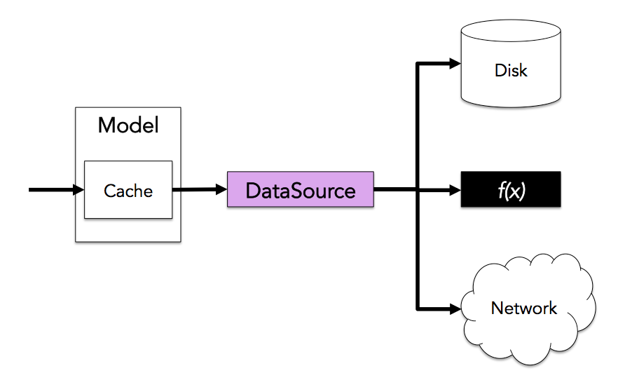

* Table of contents. This line is required to start the list.
{:toc}

# Data Sources

A DataSource is an interface which can be implemented to expose JSON Graph information to a Model. Every DataSource is associated with a single JSON Graph object. Models execute JSON Graph operations (get, set, and call) to retrieve values from the DataSource's JSON Graph object. DataSources may retrieve JSON Graph information from anywhere, including device memory, a remote machine, or even a lazily-run computation.

## DataSource Operations

DataSources implement the JSON Graph operations:

* get
* set
* call

Each JSON Graph operation is executed asynchronously, resulting in an Observable of JSONGraphEnvelope. Unlike the Model, DataSources do *not* support Path Syntax. DataSources can only accept Path Arrays and PathSet Arrays.

### The get Method

The `get` method on the DataSource interface executes the abstract JSON Graph get operation on the DataSource's associated JSON Graph object.

~~~js
interface DataSource {
  get(pathSets: Array<PathSet>): Observable<JSONGraphEnvelope>
}
~~~

To demonstrate the `get()` method in action, we'll create a DataSource by adapting a Model with an in-memory cache to the DataSource interface using the `asDataSource()` method.

~~~js
var dataSource =
    new falcor.Model({
        cache: {
            todos: [
                { $type: "ref", value: ['todosById', 44] },
                { $type: "ref", value: ['todosById', 54] },
                { $type: "ref", value: ['todosById', 97] }
            ],
            todosById: {
                "44": {
                    name: 'get milk from corner store',
                    done: false,
                    prerequisites: [
                        { $type: "ref", value: ['todosById', 54] },
                        { $type: "ref", value: ['todosById', 97] }
                    ]
                },
                "54": { name: 'withdraw money from ATM', done: false },
                "97": { name: 'pick car up from shop', done: false }
            }
        }
    }).asDataSource();
~~~

Here is an example which requests the name and status of the first two prerequisites of the first task in a TODO list.

~~~js
var response = dataSource.get([
    ["todos", 0, ["name", "done"]],
    ["todos", 0, "prerequisites", { from: 0, to: 1 }, ["name", "done"]]
]);

response.subscribe(jsonGraphEnvelope => JSON.stringify(jsonGraphEnvelope, null, 4); });
// eventually prints...
// {
//     jsonGraph: {
//         todos: {
//             0: { $type: "ref", value: ["todosById", 44] },
//         },
//         todosById: {
//             44: {
//                 name: 'get milk from corner store',
//                 done: false,
//                 prerequisites: [
//                     { $type: "ref", value: ['todosById', 54] },
//                     { $type: "ref", value: ['todosById', 97] }
//                 ]
//             },
//             "54": { name: 'withdraw money from ATM', done: false },
//             "97": { name: 'pick car up from shop', done: false }
//         }
//     }
// }
~~~

### The set Method

The `set` method on the DataSource interface executes the abstract JSON Graph set operation on the DataSource's associated JSON Graph object.

~~~js
interface DataSource {
  set(JSONGraphEnvelope): Observable<JSONGraphEnvelope>
}
~~~

To demonstrate the `set()` method in action, we'll create a DataSource by adapting a Model with an in-memory cache to the DataSource interface using the `asDataSource()` method.

~~~js
var dataSource =
    new falcor.Model({
        cache: {
            todos: [
                { $type: "ref", value: ['todosById', 44] },
                { $type: "ref", value: ['todosById', 54] },
                { $type: "ref", value: ['todosById', 97] }
            ],
            todosById: {
                "44": {
                    name: 'get milk from corner store',
                    done: false,
                    prerequisites: [
                        { $type: "ref", value: ['todosById', 54] },
                        { $type: "ref", value: ['todosById', 97] }
                    ]
                },
                "54": { name: 'withdraw money from ATM', done: false },
                "97": { name: 'pick car up from shop', done: false }
            }
        }
    }).asDataSource();
~~~

Here is an example which requests sets the status of the both prerequisites of the first task in a TODO list to "done."

~~~js
var response = dataSource.set({
  paths: [
    ["todos", 0, "prerequisities", { to:1 }, "done"]
  ],
  jsonGraph: {
    todos: {
      0: {
        prerequisites: {
          0: {
            done: true
          },
          1: {
            done: true
          }
        }
      }
    }
  }
});

response.subscribe(jsonGraphEnvelope => JSON.stringify(jsonGraphEnvelope, null, 4); });
// eventually prints...
// {
//     jsonGraph: {
//         todos: {
//             0: { $type: "ref", value: ["todosById", 44] },
//         },
//         todosById: {
//             44: {
//                 prerequisites: [
//                     { $type: "ref", value: ['todosById', 54] },
//                     { $type: "ref", value: ['todosById', 97] }
//                 ]
//             },
//             "54": { name: 'withdraw money from ATM', done: false },
//             "97": { name: 'pick car up from shop', done: false }
//         }
//     }
// }
~~~

### The call Method

The `call` method on the DataSource interface executes the abstract JSON Graph call operation on the DataSource's associated JSON Graph object. The `call` method invokes a single function located inside of the JSON graph object.

Functions are useful for non-idempotent operations which cannot be performed using `get` or `set` (ex. like adding to a list). Using a Function is appropriate when the application is performing a transactional operation that cannot be represented as a series of set operation.

JSON Graph Functions can _not_ return transient data (ex. 2 + 2 = 4). A JSON Graph function can only return a JSONGraphEnvelope containing a subset of the data in its "this" object (the object which contains the function as a member).

When a Function returns a JSONGraphEnvelope, it *must* include a "paths" key which contains PathSet Arrays or Path Arrays that point to all of the values within the JSON Graph subset in the "jsonGraph" key. This is necessary, because unlike get in and set, the client has no way of predicting what subset of JSON Graph data will be sent back to the client from the server.

One of the hazards of invoking functions is that they may change any number of values in a client's Model cache. Functions also include a "invalidated" key in their JSONGraphEnvelope result which contains all of the paths to be invalidated within the Model cache.

~~~js
interface DataSource {
  call(callPath, args, pathSuffixes, paths): Observable<JSONGraphEnvelope>
}
~~~

The `callPath` parameter is a Path Array that refers to the location of the function within the JSON Graph object. The "arguments" parameter are the arguments passed to the function. The "pathSuffixes" parameter

To demonstrate the `call()` method in action, we'll create a DataSource by adapting a Model with an in-memory cache to the DataSource interface using the `asDataSource()` method.

~~~js
var dataSource =
    new falcor.Model({
        cache: {
            todos: [
                { $type: "ref", value: ['todosById', 44] },
                { $type: "ref", value: ['todosById', 54] },
                { $type: "ref", value: ['todosById', 97] }
            ],
            todosById: {
                "44": {
                    name: 'get milk from corner store',
                    done: false,
                    prerequisites: [
                        { $type: "ref", value: ['todosById', 54] },
                        { $type: "ref", value: ['todosById', 97] }
                    ]
                },
                "54": { name: 'withdraw money from ATM', done: false },
                "97": { name: 'pick car up from shop', done: false }
            }
        }
    }).asDataSource();
~~~

Here is an example which requests sets the status of the both prerequisites of the first task in a TODO list to "done."

~~~js
var response = dataSource.set({
  paths: [
    ["todos", 0, "prerequisities", { to:1 }, "done"]
  ],
  jsonGraph: {
    todos: {
      0: {
        prerequisites: {
          0: {
            done: true
          },
          1: {
            done: true
          }
        }
      }
    }
  }
});

response.subscribe(jsonGraphEnvelope => JSON.stringify(jsonGraphEnvelope, null, 4); });
// eventually prints...
// {
//     jsonGraph: {
//         todos: {
//             0: { $type: "ref", value: ["todosById", 44] },
//         },
//         todosById: {
//             44: {
//                 prerequisites: [
//                     { $type: "ref", value: ['todosById', 54] },
//                     { $type: "ref", value: ['todosById', 97] }
//                 ]
//             },
//             "54": { name: 'withdraw money from ATM', done: false },
//             "97": { name: 'pick car up from shop', done: false }
//         }
//     }
// }
~~~

## Why Implement a DataSource?

The most common reason for implementing a DataSource is to allow data to be retrieved from the network using a specific transport protocol. The falcor library ships with the HttpDataSource, which only supports retrieving JSON Graph information from the network using the HTTP/HTTPS protocol.

## DataSource Implementations

Falcor ships with the following DataSource implementations:

* HttpDataSource
* Router (server only)
* ModelDataSource

### HttpDataSource

Falcor Models typically use the HttpDataSource to connect directly to falcor middleware running on an Http server.
## Reference Implementation

Here is a [reference implementation](https://github.com/Netflix/falcor/blob/master/examples/datasource/webWorkerSource.js) of a Data Source which retrieves information from a Model running in a WebWorker.
##Http DataSource
The falcor library ships with one implementation of the DataSource interface: the HttpDataSource. The HttpDataSource retrieves JSON Graph information
