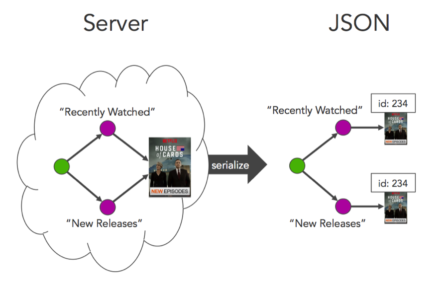
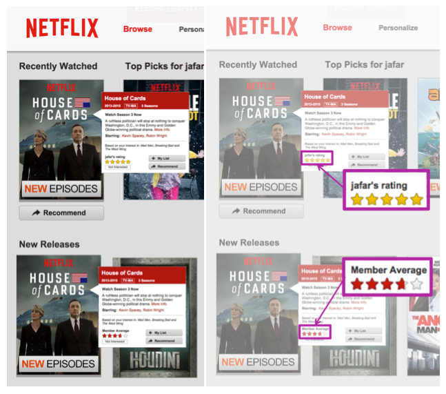
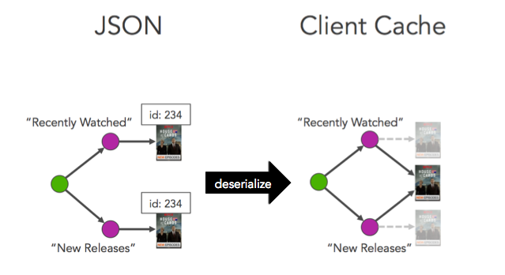

* Table of contents. This line is required to start the list.
{:toc}

# JSON Graph

## What is JSON Graph?

JSON Graph is a convention for modeling graph information as a JSON object. Applications that use Falcor represent all their domain data as a single JSON Graph object.

JSON Graph is valid JSON and can be parsed by any JSON parser. However JSON Graph introduces new primitive types to JSON to allow JSON to be used to represent graph information in a simple and consistent way. While it is possible to work with JSON Graph data directly, it is much more convenient to work with it indirectly using tools that understand JSON Graph types. One way to think about Falcor is as a set of protocols and tools for transferring, storing, and retrieving data from JSON Graph objects.

Here's a simple example of a JSON Graph Object that represents a TODO list where each task can be linked to one or more prerequisites.

~~~js
{
    todosById: {
        "44": {
            name: "get milk from corner store",
            done: false,
            prerequisites: [{ $type: "ref", value: ["todosById", 54] }]
        },
        "54": {
            name: "withdraw money from ATM",
            done: false,
            prerequisites: []
        }
    },
    todos: [
        { $type: "ref", value: ["todosById", 44] },
        { $type: "ref", value: ["todosById", 54] }
    ]
};
~~~

Note that in the example above the JSON Graph contains references to other locations in the same object. It is this concept of a Reference that allows graphs to be represented in JSON.

## Why JSON Graph?

JSON is a ubiquitous data interchange format. Web applications often exchange data in JSON format because manipulating JSON Data in JavaScript is so easy. JSON is also map–based, which makes it easy to divide a large data set into smaller subsets and send them across the wire on demand.

Unfortunately there is a downside to using JSON to send and store your Web application's data: JSON models trees, and most application domains are *graphs*. As a result, serializing a graph as JSON can introduce duplicates copies of the same entity. 

These duplicates take up additional space when sent across the wire, but they can also create a much bigger hazard: **stale data**. If changes made to one instance of an entity are not propagated to the others, the application may present stale data to the user if they are presented a different instance than the one they changed. 

To avoid this problem, developers often attempt to remove duplicates when integrating entities into the client cache. 

This usually involves assigning a unique identifier to the entity, so that the client can detect duplicates before they are added to the cache. Unfortunately as most object identifiers are not globally unique, but rather are unique among other entities of the same type, custom code must often be written for each new type added to the system.   In addition to being able to represent graphs as a JSON object, JSON Graph provides a set of abstract operations that allow your application to be able to retrieve all the data it needs for an application use case _in a single round trip_. This can dramatically reduce latency. 

## How Does JSON Graph Work?

**JSON Graph allows a graph to be modeled as JSON without _introducing duplicates_.** Instead of inserting an entity into the same message multiple times, _each entity with a unique identifier is inserted into a single, globally unique location in the JSON Graph object_. The Path to the only location within the JSON Graph object where an entity is stored is referred to as the entity's **Identity Path.** No two entities in an application's domain model should have the same Identity Path. If an entity's unique identifier (often assigned by a data store) is *not* globally unique, but rather only unique within the set of its like types, the entity's Identity Path can be changed to include both the its type and ID. This combination is usually enough to ensure that an entity's Identity Path is globally unique.

Whenever an entity needs to be referenced by another entity in the same JSON graph object, a **Reference** with the entity's Identity Path is included instead. A Reference is a new value type that JSON Graph introduces to JSON to allow graph relationships to be modeled within a JSON object. 

Here is a simple example of a JSON Graph object that contains the domain data for a TODO list.

~~~js
{
    todosById: {
        "44": {
            name: "get milk from corner store",
            done: false,
            prerequisites: [{ $type: "ref", value: ["todosById", 54] }]
        },
        "54": {
            name: "withdraw money from ATM",
            done: false,
            prerequisites: []
        }
    },
    todos: [
        { $type: "ref", value: ["todosById", 44] },
        { $type: "ref", value: ["todosById", 54] }
    ]
};
~~~

JSON Graph References are just like symbolic links in the UNIX file system. Symbolic links are just files that contain a path. However if the shell encounters a symbolic link while evaluating a Path, the shell begins evaluating the path within the symbolic link. It is this awareness of symbolic links that allows graphs to be represented in a hierarchical structure. Falcor provides several operations for retrieving and modifying JSON Graph objects. These operations recognize References and automatically traverse them. This allows you to ensure that the graph only contains one instance of every entity, while navigating the graph as if the entity appears in multiple places.

For example, we can use the abstract get operation to retrieve the name of the prerequisite in the first task in the TODO list above.

~~~js
get(["todos", 0, "prerequisites", 0, "name"]);
~~~

The code above will eventually return a response that contains "withdraw money from ATM". Note that we navigate the graph using the same set of keys if we were traversing an in-memory JavaScript Graph. For more information, see "Abstract JSON Graph Operations".

## New Primitive Value Types 

In addition to JSON’s primitive types, JSON Graph introduces three new primitive types:  

1. Reference  
2. Atom  
3. Error   

Each of these types is a JSON Graph object with a "$type" key that differentiates it from regular JSON objects, and describes the type of its “value” key. These three JSON Graph primitive types are always retrieved and replaced in their entirety just like a primitive JSON value.  None of the JSON Graph values can be mutated using any of the available abstract JSON Graph operations.

### Reference   

A Reference is a JSON object with a “$type” key that has a value of “ref” and a ”value” key that has a Path array as its value. 

~~~js
{ $type: "ref", value: ["todosById", 44] }
~~~

A Reference’s Path points to another location within the same JSON Graph object. Using References, it is possible to model a graph in JSON. Here is an example of a TODO list in which each task can contain References to its prerequisite tasks: 

~~~js
{
    todosById: {
        "44": {
            name: "get milk from corner store",
            done: false,
            prerequisites: [{ $type: "ref", value: ["todosById", 54] }]
        },
        "54": {
            name: "withdraw money from ATM",
            done: false,
            prerequisites: []
        }
    },
    todos: [
        { $type: "ref", value: ["todosById", 44] },
        { $type: "ref", value: ["todosById", 54] }
    ]
};
~~~

A Reference is like a symbolic link in the UNIX file system. When the Path is being evaluated, and a Reference is encountered when there are still keys in the Path left to evaluate, the reference is followed from the root to its target object, and the remaining keys in the Path are evaluated. If a Reference is discovered at the last key in a path, the Reference itself is returned as the result. 

### Atom

An Atom is a JSON object with a “$type” key that has a value of “atom” and a ”value” key that contains a JSON value.

~~~js
{ $type: "atom", value: ['en', 'fr'] }
~~~

JSON Graph allows metadata to be attached to values to control how they are handled by clients. For example, metadata can be attached to values to control how long values stay a client cache. For more information see [Sentinel Metadata](./model.md#Sentinel-Metadata).

One issue is that JavaScript value types do not preserve any metadata attached to them when they are serialized as JSON:

~~~js
var number = 4;
number['$expires'] = 5000;

console.log(JSON.stringify(number, null, 4))

// This outputs the following to the console:
// 4
~~~

Atoms "box" value types inside of a JSON object, allowing metadata to be attached to them. 

~~~js
var number = {
    $type: "atom",
    value: 4,
    $expires: 5000
};

console.log(JSON.stringify(number, null, 4))

// This outputs the following to the console:
// {
//     "$type": "atom",
//     "value": 4,
//     "$expires": 5000
// } 
~~~

The value of an Atom is always treated like a value type, meaning it is retrieved and set in its entirety. An Atom cannot be mutated using any of the abstract JSON Graph operations. Instead you must replace Atoms entirely using the abstract set operation.

In addition to making it possible to attach metadata to JSON values, Atoms can be used to get around the restriction against retrieving JSON Objects and Arrays. Let's say that we have an Array which we are certain will remain small, like a list of video subtitles for example. By boxing the subtitles Array in an Atom, we are able to retrieve the entire Array using the abstract get operation. Here is an example using a Falcor Model, which is an object capable of executing the abstract get operation on a JSON Graph.

~~~js
var log = console.log.bind(console)

var model = new falcor.Model({cache: {
    titlesById: {
        "44": {
            name: "Die Hard",
            subtitles: { $type: "atom", value: ['en', 'fr'] }
        }
    }
}});

model.getValue(['titlesById', 44, 'subtitles']).then(log)

// This outputs the following to the console:
// ['en', 'fr']
~~~

The result above only includes the value of the Atom because the Model unboxes Atoms by default.

### Error

An Error is a JSON object with a “$type” key that has a value of “error” and a ”value” key that contains an error that occured while executing a JSON Graph operation.

~~~js
{ $type: "error", value: "The request timed out." }
~~~

When an object executing a JSON Graph operation encounters an error while attempting to set or retrieve a value, an Error object may be created and placed in the JSON Graph response in the value's place.

To understand when an Error object might appear in a JSON Graph, let's take a look at the Router object. A Router is an object which creates a virtual JSON Graph from a variety of different DataSources. Instead of creating a JSON Graph object ahead of time, the Router creates the requested values on demand by retrieving them from one or more Data Sources. The Router is capable of executing all of the abstract JSON Graph operations. As a result, the Router creates the illusion that the JSON Graph object exists even if the data is actually organized very differently and is spread across any number of different data stores. 

Below is an example of a Router that supports retrieving the name of the current user in a virtual JSON Graph object. Instead of retrieving the data from an in-memory object, it matches the incoming Path against a pattern and requests the value from a service.

~~~js
var router = new Router([
    {
        route: "user.name",
        get: function(pathSet) {
            return userService.getUser().
                then(
                    function(user) {
                        return { path: ['user', 'name'], value: user.name };
                    },
                    function(error) {
                        return { path: ['user'], value: { $type: "error", value: error.message } };
                    });
        }
    }
]);
~~~

As the router is not reading the data from an in-memory JSON Graph object, but is instead retrieving it from a remote data source, errors may occur. For example, the remote data source may be under heavy load and unable to serve the request before it times out. In this circumstance, the Router will insert a JSON Graph Error object in its response.

~~~js
router.get(["user", "name"]).subscribe(function(jsonGraphEnvelope) {
    console.log(JSON.stringify(jsonGraphEnvelope, null, 4));
});
// prints the following to the console if the user service times out
// {
//     jsonGraph: {
//         user: {
//             $type: "error", 
//             value: "request timed out"
//         }
//     }
// }
~~~

The ability to place an Error within a JSON Graph response allows for other successfully-retrieved values to be included alongside the error in the same response. This ensures that if multiple values are requested from a JSON Graph object a single error does not prevent the caller from retrieving any data.

## The Abstract JSON Graph Operations  

There are three abstract operations that can be carried out on a JSON Graph object: 

1. get 
2. set 
3. call   

Each of these operations must be carried out by an intermediary. This layer of indirection allows us the true location and organization of the data to be abstracted away from the caller.
 
Some examples of objects that are capable of carrying out the abstract JSON Graph operations are:  

* Router
* Model
 
The result of each operation is a JSON Graph envelope, which contains a subset of the JSON Graph after the operation has completed. A JSON Graph Envelope is a JSON object with a "jsonGraph" key which contains a JSON Graph subset.

~~~js
// the result of a get operation for the Path ["user", "name"]
{
    jsonGraph: {
        user: {
            name: "Anupa"
        }
    }
}
~~~

When the call operation is invoked, the JSON Graph envelope may also contain a "invalidated" key which contains a list of Paths to values that the function call changed. This allows clients that are maintaining a cache of the JSON Graph to get rid of stale data. The envelope will also contain a "paths" key which contains a list of paths to the values within the JSON Graph subset. This is an optimization to allow clients to be able to process the JSON Graph subset without resorting to reflection.

### The Abstract get Operation

It is possible to retrieve primitive values from a JSON Graph object using the abstract get operation. The input to the abstract get operation can be any number of Paths to the values to be retrieved. The output is a subset of the JSON Graph object that contains all of the primitive values encountered while evaluating the input Paths. The abstract get operation must be idempotent. Executing a get operation must not change any values in the JSON Graph. 

Let's walk through an abstract get operation on an example JSON Graph object:

~~~js
{
    todosById: {
        "44": {
            name: "get milk from corner store",
            done: false,
            prerequisites: [{ $type: "ref", value: ["todosById", 54] }]
        },
        "54": {
            name: "withdraw money from ATM",
            done: false,
            prerequisites: []
        }
    },
    todos: [
        { $type: "ref", value: ["todosById", 44] },
        { $type: "ref", value: ["todosById", 54] }
    ]
}
~~~

Let’s evaluate the following Path in an attempt to retrieve the name of the first task in the TODOs list.

~~~js
["todos", 0, "name"]
~~~

First we evaluate the ”todos” key, which yields an array.  There are more keys to be evaluated, so we continue. Then we evaluate the number “0” key, and it is converted into a string using JSON stringify algorithm. We attempt to look up the value in the array, and we find a reference:  

~~~js
// JSON Graph object
{
    // "todosById" object snipped
    todos: [
        { $type: "ref", value: ["todosById", 44] },
        // rest of list snipped
    ]
}
// JSON Graph Envelope response
{
    jsonGraph: {}
}
~~~

References are primitive value types, and are therefore immediately inserted into the subset of the JSON Graph object that will be produced by the abstract get operation. 

~~~js
// JSON Graph object
{
    // "todosById" object snipped
    todos: [
        { $type: "ref", value: ["todosById", 44] },
        // rest of list snipped
    ]
}
// JSON Graph Envelope response
{
    jsonGraph: {
        todos: {
            "0": { $type: "ref", value: ["todosById", 44] }
        }
    }
}
~~~

References are handled specially during Path evaluation. If a Reference is encountered when there are still keys left in the path to be evaluated, a new Path is created. The new path is formed by concatenating the remaining keys to the end of the reference Path. This process is known as “path optimization”, because the optimized Path we create is a quicker route to the requested value. Path optimization produces the following Path:  

~~~js
["todosById", 44].concat(["name"]) // ["todosById", 44, "name"]
~~~

Once we create an optimized path, we begin evaluating it from the root of the JSON Graph object. 

~~~js
// evaluating ["todosById", 44, "name"]
{
    todosById: {
        "44": {
            name: "get milk from corner store",
            done: false,
            prerequisites: [{ $type: "ref", value: ["todosById", 54] }]
        },
        "54": {
            name: "withdraw money from ATM",
            done: false,
            prerequisites: []
        }
    },
    todos: [
        { $type: "ref", value: ["todosById", 44] },
        { $type: "ref", value: ["todosById", 54] }
    ]
};
// JSON Graph Envelope response
{
    jsonGraph: {
        todos: {
            "0": { $type: "ref", value: ["todosById", 44] }
        }
    }
}
~~~

Now we evaluate the “tasksById” key, which yields an object. Next, we convert the number 44 into a string using the JSON stringify algorithm. Then we look up the resulting string “44” which yields another object. Finally we look up the key “name” and we find a primitive value type ”withdraw money from ATM”. This value is added to the JSON Graph subset and returned as the result of the abstract get operation. 

~~~js
// JSON Graph Envelope response
{
    jsonGraph: {
        todosById: {
            "44": {
                name: "get milk from corner store"
            }
        },
        todos: {
            "0": { $type: "ref", value: ["todosById", 44] }
        }
    }
}
~~~

###  Retrieving References  

As we saw in the previous section, when references are encountered while there are still keys in the path left to be evaluated, the path is optimized. However, if the reference is encountered and there are no more keys in the path left to be evaluated, the reference itself is returned rather than its target object. To see this process in action, let’s start with the same JSON Graph document we used in the previous section:    

~~~js
{
    todosById: {
        "44": {
            name: "get milk from corner store",
            done: false,
            prerequisites: [{ $type: "ref", value: ["todosById", 54] }]
        },
        "54": {
            name: "withdraw money from ATM",
            done: false,
            prerequisites: []
        }
    },
    todos: [
        { $type: "ref", value: ["todosById", 44] },
        { $type: "ref", value: ["todosById", 54] }
    ]
};
~~~

Let’s evaluate the following path to retrieve the reference to the first task in the TODO list:

~~~js
["todos", 0]
~~~

First we evaluate the ”todos” key, which yields an array.  There are more keys to be evaluated, so we continue. Then we evaluate the number “0” key, and it is converted into a string using JSON stringify algorithm. We attempt to look up the value in the array, and we find a reference:  

~~~js
{
    // "todosById" object snipped...
    todos: [
        { $type: "ref", value: ["todosById", 44] },
        // rest of "todos" list snipped...
    ]
};
~~~

References are primitive value types, and are therefore inserted into the subset of the JSON Graph object that will be produced by the abstract get operation. Now there are no more keys in the path left to be evaluated, so the JSON Graph subset is returned as the result of the abstract get operation.

~~~js
// JSON Graph Envelope response
{
    jsonGraph: {
        todos: {
            "0": { $type: "ref", value: ["todosById", 44] }
        }
    }
}
~~~

### Short-circuiting   

If a primitive value is encountered while evaluating a path, the get operation short-circuits, and the value type is included in the JSON Graph subset that is returned as the result of the abstract get operation. Let’s take a look at this process in action. We will start with the same JSON Graph object we used in the previous section: 

~~~js
{
    todosById: {
        "44": {
            name: "get milk from corner store",
            done: false,
            prerequisites: [{ $type: "ref", value: ["todosById", 54] }]
        },
        "54": {
            name: "withdraw money from ATM",
            done: false,
            prerequisites: []
        }
    },
    todos: [
        { $type: "ref", value: ["todosById", 44] },
        { $type: "ref", value: ["todosById", 54] }
    ]
};
~~~

This time we will attempt to retrieve the name of the 9th item from the TODO list, even though the list is only three items long.   

~~~js
["todos", 9, "name"]
~~~

First we evaluate the ”todos” key, which yields an array.  There are more keys to be evaluated, so we continue. Then we evaluate the “9” key, and it is converted into a string using JSON stringify algorithm. We attempt to look up the value in the array, which yield an undefined value. The undefined value is added to the JSON Graph subset, which is returned as the result of the abstract get operation:

~~~js
// JSON Graph Envelope response
{
    jsonGraph: {
        todos: {
            "9": undefined
        }
    }
}
~~~

### The Abstract set Operation  

In addition to retrieving values from a JSON graph object, it is possible to set values into a JSON Graph object. The abstract set operation accepts multiple Path/value pairs. It returns a subset of the JSON Graph that contains all of the References encountered during path evaluation, as well as the values inserted into the JSON Graph. It is only legal to set primitive values into a JSON Graph object. A single set operation should modify only one value in the JSON Graph for each input path. If it is necessary to set values at paths which cannot be known ahead of time, you must use an abstract call operation instead. Set operations must be idempotent. 

Let’s walk through this process using the same JSON graph object we used in the previous section.  

~~~js
{
    todosById: {
        "44": {
            name: "get milk from corner store",
            done: false,
            prerequisites: [{ $type: "ref", value: ["todosById", 54] }]
        },
        "54": {
            name: "withdraw money from ATM",
            done: false,
            prerequisites: []
        }
    },
    todos: [
        { $type: "ref", value: ["todosById", 44] },
        { $type: "ref", value: ["todosById", 54] }
    ]
};
~~~

We will attempt to mark the first task in the TODOs list as done using the following Path/value combination:  

~~~js
{ path: ["todos", 0, "done"], value: true }
~~~

First we evaluate the ”todos” key, which yields an array.  There are more keys to be evaluated, so we continue. Then we evaluate the number “0” key, and it is converted into a string using JSON stringify algorithm. We attempt to look up the value in the array, and we find a reference:  

~~~js
// JSON Graph object
{
    // "todosById" object snipped
    todos: [
        { $type: "ref", value: ["todosById", 44] },
        // rest of list snipped
    ]
}
// JSON Graph Envelope response
{
    jsonGraph: {}
}
~~~

References are primitive value types, and are therefore immediately inserted into the subset of the JSON Graph object that will be produced by the abstract set operation. However References are handled specially during path evaluation. If a Reference is encountered when there are still keys left in the path to be evaluated, a new path is created by concatenating the keys that have yet to be evaluated to the end of the reference path. This process is known as “path optimization”, because the optimized path we create is a quicker route to the requested value. Path optimization produces the following path: 

~~~js
["todosById", 44].concat(["name"]) // ["todosById", 44, "name"]
~~~

Once we create an optimized path, we begin evaluating it from the root of the JSON Graph object. 

~~~js
// evaluating ["todosById", 44, "name"]
{
    todosById: {
        "44": {
            name: "get milk from corner store",
            done: false,
            prerequisites: [{ $type: "ref", value: ["todosById", 54] }]
        },
        "54": {
            name: "withdraw money from ATM",
            done: false,
            prerequisites: []
        }
    },
    todos: [
        { $type: "ref", value: ["todosById", 44] },
        { $type: "ref", value: ["todosById", 54] }
    ]
};
// JSON Graph Envelope response
{
    jsonGraph: {
        todos: {
            "0": { $type: "ref", value: ["todosById", 44] }
        }
    }
}
~~~

Now we evaluate the “tasksById” key, which yields an object. Next, we convert the number 44 into a string using the JSON stringify algorithm. Then we look up the resulting string “44” which yields another object. Finally we arrive at the last key: “name”. We replace the value at this location with the new value: true. We also insert the value into the JSON Graph subset, and return the JSON Graph subset as the new result of the abstract set operation. 

~~~js
// JSON Graph object
{
    todosById: {
        "44": {
            name: "get milk from corner store",
            done: true,
            prerequisites: [{ $type: "ref", value: ["todosById", 54] }]
        },
        "54": {
            name: "withdraw money from ATM",
            done: false,
            prerequisites: []
        }
    },
    todos: [
        { $type: "ref", value: ["todosById", 44] },
        { $type: "ref", value: ["todosById", 54] }
    ]
};
// JSON Graph Envelope response
{
    jsonGraph: {
        todosById: {
            "44": {
                done: true
            }
        },
        todos: {
            "0": { $type: "ref", value: ["todosById", 44] }
        }
    }
}
~~~

#### Setting Beyond Primitive Values  

As we saw in the previous section, if we encounter a Reference while setting a Path, the Reference Path is followed to the target object. As we now know, References are handled specially during Path evaluation. However if we encounter a primitive value while setting a value into the JSON Graph object, then the primitive value is replaced with an object and the abstract set operation continues. Let’s see an example of this in practice. We will start with the same JSON graph object we used in the previous section:  

~~~js
{
    todosById: {
        "44": {
            name: "get milk from corner store",
            done: false,
            prerequisites: [{ $type: "ref", value: ["todosById", 54] }]
        },
        "54": {
            name: "withdraw money from ATM",
            done: false,
            prerequisites: []
        }
    },
    todos: [
        { $type: "ref", value: ["todosById", 44] },
        { $type: "ref", value: ["todosById", 54] }
    ]
};
~~~

This time we will attempt to replace the ”done” key value with an object that contains one value: a boolean indicating that the task was completed. We will set the following Path/value pair:

~~~js
{ path: ["todos", 0, "done", "completed"], value: true }
~~~

First we evaluate the ”todos” key, which yields an array.  There are more keys to be evaluated, so we continue. Then we evaluate the number “0” key, and it is converted into a string using JSON stringify algorithm. We attempt to look up the value in the array, and we find a reference:  

~~~js
// JSON Graph object
{
    // "todosById" object snipped
    todos: [
        { $type: "ref", value: ["todosById", 44] },
        // rest of list snipped
    ]
}
// JSON Graph Envelope response
{
    jsonGraph: {}
}
~~~

References are primitive value types, and are therefore immediately inserted into the subset of the JSON Graph object that will be produced by the abstract get operation. Then an optimized path is created using the reference path and the keys that have yet to be evaluated. 

~~~js
["todosById", 44].concat(["done", "completed"]) // ["todosById", 44, "done", "completed"]
~~~

Once we create an optimized path, we begin evaluating it from the root of the JSON Graph object. 

~~~js
// setting ["todosById", 44, "done", "completed"] to true
{
    todosById: {
        "44": {
            name: "get milk from corner store",
            done: false,
            prerequisites: [{ $type: "ref", value: ["todosById", 54] }]
        },
        "54": {
            name: "withdraw money from ATM",
            done: false,
            prerequisites: []
        }
    },
    todos: [
        { $type: "ref", value: ["todosById", 44] },
        { $type: "ref", value: ["todosById", 54] }
    ]
};
// JSON Graph Envelope response
{
    jsonGraph: {
        todos: {
            "0": { $type: "ref", value: ["todosById", 44] }
        }
    }
}
~~~

Now we evaluate the “tasksById” key, which yields an object. Next, we convert the number 44 into a string using the JSON stringify algorithm. Then we look up the resulting string “44” which yields another object. Now we look up the ”done” key and find a primitive value: false. As there are more keys to be evaluated, the object evaluating the abstract set operation attempts to replace the primitive value with an object. 

~~~js
// setting ["todosById", 44, "done", "completed"] to true
{
    todosById: {
        "44": {
            name: "get milk from corner store",
            done: {},
            prerequisites: [{ $type: "ref", value: ["todosById", 54] }]
        },
        // rest of "todosById" object snipped
    },
    // "todos" list snipped
};
// JSON Graph Envelope response
{
    jsonGraph: {
        todos: {
            "0": { $type: "ref", value: ["todosById", 44] }
        }
    }
}
~~~

Now that we have reached the final key “completed”, we insert the boolean value “true” that key within the object we previously created. The value is also added at the same location within the JSON Graph subset, and returned as the result of the abstract set operation.

~~~js
// setting ["todosById", 44, "done", "completed"] to true
{
    todosById: {
        "44": {
            name: "get milk from corner store",
            done: { completed: true },
            prerequisites: [{ $type: "ref", value: ["todosById", 54] }]
        },
        // rest of "todosById" object snipped
    },
    // "todos" list snipped
};
// JSON Graph Envelope response
{
    jsonGraph: {
        todosById: {
            "44": {
                done: { completed: true }
            }
        },
        todos: {
            "0": { $type: "ref", value: ["todosById", 44] }
        }
    }
}
~~~

#### Value Coercion  

The object evaluating the abstract set operation may choose to coerce the value being set into a different value. If so, the JSON Graph object, as well as the JSON Graph subset response will contain the coerced value after the abstract set operation completes. Take the following JSON Graph object, which models titles that can be viewed in an online video streaming application.   

(For example)  

Let’s attempt to set the rating of the title to 10, even though the only ratings allowed are between 1 and 5.   

(Example)  

Firstly evaluate the “titlesById” key. We find a object, so we continue. We evaluate the number “721” key, and convert it into a string using the JSON stringify method. We find another object, so we continue. Finally we attempt to set the ”rating” key to “9”, and the object evaluating the abstract set operation instead sets the rating to the upper bound of valid values: “5”. The number five is inserted in both the JSON Graph object, as well as the JSON Graph subset. The JSON Graph subset response is returned as the result of the abstract set operation. 

### The Abstract call Operation

A JSON Graph object is not a strict subset of JSON. Unlike JSON objects, JSON Graph objects may contain Functions. Functions are callable blocks of code that return a subset of the JSON Graph object. Functions can be used to change multiple resources in a single round trip. Functions are most often used for adding and removing items from a list. Functions must be used whenever multiple values need to be changed together, such as adding items to a list.  Unlike get and set operations, function calls are not guaranteed to be idempotent.

Like JavaScript objects, functions can appear anywhere in the JSON Graph object. Like other non-primitive values, functions cannot be retrieved or set using the abstract get or set operations. It is only possible to call a function, and pass it arguments.  

In order to call a function, you must specify the path to the function, as well as the arguments to pass to the function. The arguments can be any JSON Graph value other than a function, including arrays, objects, and the primitive values.  A function must either return the new value at every path it has changed, or add the path to  the list of invalidated paths. The invalidated paths are a list of paths that may have been changed by the function. The invalidated paths are included in the function’s response along with the JSON Graph subset. Callers remove the invalidated paths from their local cache to ensure that their cache does not contain stale data.   Let’s walk through the process of adding an item to a list using call. We will use the JSON Graph object we used in the previous section.   

(same old example)   

In this example, we will call the ”push” function on the TODOs list. 

