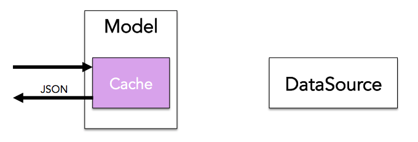
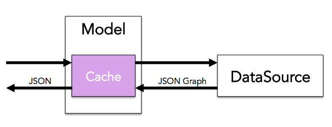
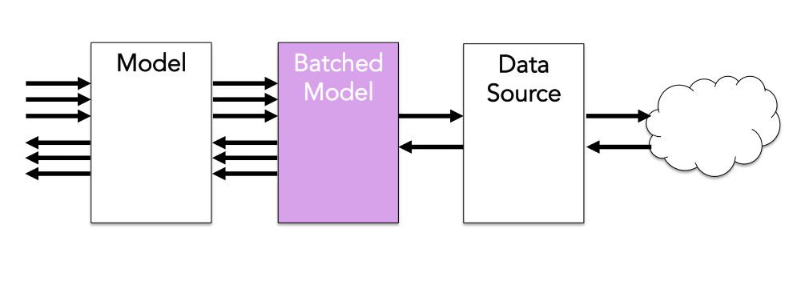

* Table of contents. This line is required to start the list.
{:toc}

# Model Overview

Your application can use Data Sources to retrieve JSON Graph data from the network. However it is rarely ideal for your application's views to interact directly with data sources for the following reasons:

1. Application views typically navigate information hierarchically in JSON format, and Data Sources return data in JSON Graph format. 
2. Views need to be responsive to user input, but retrieving data from a Data Source may introduce considerable latency if the Data Source accesses the network.
3. In response to user navigation (ex. scrolling through a list), views may need to repeatedly access small quantities of fine-grained data in rapid succession. Data Sources typically access the network where fine-grained requests are often inefficient, because of the overhead required to issue a request.
4. Navigating information hierarchically rather than retrieving information using id's can lead to inefficent back-end requests.

For these reasons Views retrieve their data from the Model objects, which act as intermediaries between the view and the Data Source. Models abstract over Data Sources and provide several important services:

* Models convert JSON Graph information retrieved from the Data Source into JSON.
* Models reduce latency by caching data previously-retrieved from the Data Source in an in-memory cache.
* Models achieve more efficient network access patterns by batching multiple concurrent requests for information from the view into batched requests to the Data Source.
* Models optimize your view's outgoing requests to the Data Source using previously-cached JSON Graph references.

## How the Model Works

Models use a DataSource to retrieve data from the JSON object. Falcor ships with HttpDataSource, an implementation of the DataSource interface which proxies requests to another DataSource running on an HTTP server (usually a falcor Router).
 

You can associate a DataSource with a Model by passing it to the Model constructor.

~~~js
var model = new falcor.Model({source: new falcor.HttpDataSource('/model.json')});
~~~

You can implement the DataSource interface to allow a Model to communicate with a remote JSON object over a different transport layer (ex. web sockets). For more information see [Data Sources](./datasources.md).

If a Model does _not_ have a [DataSource](./datasources.md), all Model operations will be performed on the Model's local cache. When you initialize the Model, you can prime its cache with a JSON object.
 
~~~js
var log = console.log.bind(console)

var model = new falcor.Model({
    cache: {
        todos: [
            {
                name: 'get milk from corner store',
                done: false
            },
            {
                name: 'withdraw money from ATM',
                done: true
            }
        ]
    }});
~~~

You can transform and retrieve values by passing the Model the [Paths](./paths.md) to those values within its associated JSON object.

~~~js
// This outputs the following to the console:
// get milk from corner store
model.getValue('todos[0].name').then(log);
~~~

It is common practice to begin working against mock data in a Model cache, and then replace it with a DataSource that retrieves data from the server later on.
 
~~~js
var log = console.log.bind(console)

var model = new falcor.Model({
    source: new falcor.HttpDataSource('/model.json'),
});

model.getValue('todos[0].name').then(log);
~~~

When data is retrieved from a DataSource, it is placed into the Model's local cache. Subsequent requests for the same information will not trigger a request to the DataSource if the data has not been purged from the local cache.

~~~js
// Does not trigger a request to the server.
model.getValue('todos[0].name').then(log);
~~~

There is one very important difference between working with a JSON object directly and working with that same JSON object through a Falcor Model: **you can only retrieve value types from a Model.**  

### "Why can't I request Objects or Arrays from a Model?"

_Falcor is optimized for displaying data catered to your views._ Both Arrays and Objects can contain an unbounded amount of data. Requesting an Array or Object in it's entirety is equivalent to your view requesting 'SELECT *' without a 'WHERE' clause in the SQL world. An Array that contains 5 items today, can grow to contain 10,000 items later on. This means that requests which are initially served quickly and fit the view's requirements can become slower over time as more data is added to backend data stores.

Models force developers to be explicit about which value types they would like to retrieve in order to maximize the likelihood that server requests for data will have **stable performance** over time. Rather than allow you to retrieve an entire Object, Models force you to _be explicit_ and retrieve only those values needed in a given scenario. Similarly when displaying an Array of items, Models do not allow you to retrieve the entire Array upfront. Instead you must request the first visible page of an Array, and follow up with additional page requests as the user scrolls. This allows your client code to control performance boundaries, based on the amount of data actually used in the view, as opposed to being susceptible to unexpected increases in the total amount of data available.

In the following example we page through a list of TODOs, selecting the name and done property of all the TODOs in the current page.

~~~js
var model = new falcor.Model({
    source: new falcor.HttpDataSource('/todos.json')
});

function showPage(page) {
    //selecting just the props needed to display table row
    var from = page, to = page + 5;
    model.get('todos[' + from + '..' + to + ']["name", "done"]').
        then(function(response) {
            var html = "<ul>";
            var todo;
            for (var i = from; i < to; i++) {
                todo = response.json.todos[i];
                if (todo)
                    html += "<li>" + todo.name + " </li>";
            }
            html += "</ul><a onclick='showPage(" + to + ")'>Next</a>";
            document.body.innerHTML = html;
        });
};
showPage(0);

// // The code above prints the following html:
// <ul>
//     <li>get milk from corner store </li>
//     <li>withdraw money from ATM </li>
// </ul>
// <a onclick="showPage(5)">Next</a>
~~~

If you are certain that an Object or Array will remain a constant size, you can indicate to a Model that they should always be retrieved in their entirety by using an Atom. For more information, see [JSON Graph Atoms](#JSON-Graph-Atoms).

# Creating a Model

A Model may be created by invoking the Model constructor. Model constructor can be passed an options object that supports the following keys:

* cache
* maxSize
* collectRatio
* source
* onChange
* comparator
* errorSelector

~~~js
var modelOptions = { /* options keys here */ };
var model = new falcor.Model(modelOptions);
~~~

## The cache, maxSize, and collectRatio values

These optional values can be used to configure the Model Cache. For more information, see [The Model Cache](#The-Model-Cache).

## The source value

The optional source value in the Model constructor options object can be initialized to a DataSource. Models use DataSources to retrieve JSON information. For more information, see [DataSources](./datasources.md).

## The onChange and comparator values

These optional values relate to change detection. For more information on Change Detection, see [Model Change Detection](#Model-Change-Detection).

## The errorSelector value

The optional errorSelector function can be used to transform errors that are returned from the [DataSource](./datasources.md) before they are stored in the [Model Cache](#The-Model-Cache).

In this example, we use an errorSelector function to add a relative expiration time of two minutes to every error received from the DataSource.

~~~js
var model = new falcor.Model({
    source: new falcor.HttpDataSource('/model.json'),   
    errorSelector: function(error){
        error.$expires = -1000 * 60 * 2;
    }
});
~~~

# Working With Data Using a Model

The Falcor Model is intended to be the "M" in your MVC. Rather than interact with JSON data directly, your application's views interact with data _indirectly_ through the Model object. The Model object provides a set of familiar JavaScript APIs for working with JSON data, including get, set, and call. 

Here is an example of working with JSON data directly:

~~~js
var log = console.log.bind(console)

var model = {
    todos: [
        {
            name: 'get milk from corner store',
            done: false
        },
        {
            name: 'withdraw money from ATM',
            done: true
        }
    ]
};

// This outputs the following to the console:
// get milk from corner store 
console.log(model.todos[0].name);
~~~

The main difference between working with JSON data directly and working with it indirectly through a Model object, is that the Falcor Model has a _push API_. Here is an example of working with a JSON object indirectly using a Falcor Model:

~~~js
var log = console.log.bind(console)

var model = new falcor.Model({cache: {
    todos: [
        {
            name: 'get milk from corner store',
            done: false
        },
        {
            name: 'withdraw money from ATM',
            done: true
        }
    ]
}});

// This outputs the following to the console:
// get milk from corner store 
model.getValue('todos[0].name').then(log);
~~~

Note that in the example above, the name of the TODO is _pushed_ to a call back.
 
The main advantage of using a push API is that you can code against JSON data the same way regardless of whether the data is local or remote. This makes it very easy to begin coding your application against mocked data at first, and then work against server data later on without changing client code.

In this example we retrieve the name of the first TODO from a JSON Object: 

~~~js
var log = console.log.bind(console)

var model = new falcor.Model({cache: {
    todos: [
        {
            name: 'get milk from corner store',
            done: false
        },
        {
            name: 'withdraw money from ATM',
            done: true
        }
    ]
}});

model.getValue('todos[0].name').then(log);
~~~

In this code sample the data has been moved to the cloud, but the client code that retrieves the data remains the same:

~~~js
var model = new falcor.Model({source: new falcor.HttpDataSource('/model.json')});

model.getValue('todos[0].name').then(log);
~~~

## Retrieving Data from the Model

When retrieving data from the Model, developers are typically attempting to do one of the following:

1. Retrieve a single value
2. Retrieving JSON Graph data as JSON
3. Transforming JSON Graph data directly into view objects

### 1. Retrieve a Single Value

The Model's getValue Method can be used to retrieve a single value from the DataSource. The getValue Method has the following signature:

~~~js
class Model {
    getValue(Path): ModelResponse
}
~~~

Here is an example of retrieving a single value from a Model using getValue:

~~~js
var dataSource = new falcor.HttpDataSource("/model.json");
var model = new falcor.Model({
    source: dataSource
});

// prints "go to the ATM"
model.getValue(["todos", 0,"name"]).then(function(name){
    console.log(name);
});
~~~

### 2. Retrieving JSON Graph Data as JSON

The Model's get Method can be used to retrieve data from the DataSource. The get Method has the following signature:

~~~js
class Model {
    get(...PathSet): ModelResponse
}
~~~

While Models retrieve information from DataSources in JSON Graph format, they emit information in JSON format. You can retrieve JSON data from a Model by passing the get method any number of PathSets. In the following example, we will retrieve the names of the first two tasks in a TODOs list from a Model.

~~~js
var dataSource = new falcor.HttpDataSource("/model.json");
var model = new falcor.Model({
    source: dataSource
});

model.get(["todos", {from: 0, to:1},"name"], ["todos", "length"]).then(function(response){
    console.log(JSON.stringify(response));
});
~~~

The Model forwards the requested paths to the Data Source's get method. The Data Source executes the abstract JSON Graph get operation on its associated JSON Graph object. The result is a subset of the Data Source's JSON Graph object containing all of the values found at the requested paths, as well as any [JSON Graph References](#JSON-Graph-References) encountered along the requested paths.

~~~js
// DataSource Response
{
    todos: {
        "0": { $type: "ref", value: ["todosById", 44] },
        "1": { $type: "ref", value: ["todosById", 54] },
        "length": 10
    },
    todosById: {
        "44": {
            name: 'get milk from corner store'
        },
        "54": {
            name: 'withdraw money from ATM'
        }
    }
};
~~~

The Model merges the response from the DataSource into its internal JSON Graph cache, and creates a JSON format copy of the response by replacing all JSON Graph Reference objects with real object references. The resulting JSON object is returned to the caller in an envelope, and printed to the console:

~~~js
model.get(["todos", {from: 0, to:1},"name"], ["todos", "length"]).then(function(response){
    console.log(JSON.stringify(response));
});
// The following JSON envelope is eventually printed to the console:
// {
//     json: {
//         todos: {
//             "0": {
//                 name: 'get milk from corner store'
//             },
//             "1": {
//                 name: 'withdraw money from ATM'
//             },
//             "length": 10
//         }
//     }
// }
~~~

## Setting Values Using the Model

In addition to retrieving values from a DataSource using a Model, you can also use a Model to set values into a DataSource. Set operations immediately write to the Model's local cache, and then write to the DataSource. That means that changes are reflected on the client immediately. However, if the attempt to modify the data in the DataSource fails, the Model's cache will eventually be updated with the post-set value of the DataSource. This is sometimes referred to as eventual consistency.

When setting information using the Model, developers are usually trying to do one of the following operations:

1. Set a single value
2. Set values using multiple PathValue objects
3. Set values using a JSONEnvelope

### 1. Set a Single Value

The Model's setValue Method can be used to set a single value in the DataSource. The setValue Method has the following signature:

~~~js
class Model {
    setValue(Path): ModelResponse
}
~~~

Here is an example of setting a single value using a Model using setValue:

~~~js
var dataSource = new falcor.HttpDataSource("/model.json");
var model = new falcor.Model({
    source: dataSource
});

// prints "true"
model.setValue(["todos", 0,"done"], true).then(function(done){
    console.log(done);
});
~~~

### 2. Set Values Using Multiple PathValue Objects 

In order to change multiple values using a single DataSource request, you can pass multiple PathValue objects to the Model's set method. 

~~~js
class Model {
    set(...PathValue): ModelResponse
}
~~~

A PathValue object is a combination of a path and a value. You can create a PathValue object using the pathValue factory function:

~~~js
var pathValue = falcor.pathValue("todos[0].done",true);
// prints {path:["todos",0,"done"],value:true}
console.log(JSON.stringify(pathValue));
~~~

In the following example, we will set the done value of the first two tasks in a TODOs list to "true".

~~~js

var dataSource = new falcor.HttpDataSource("/model.json");
var model = new falcor.Model({
    source: dataSource
});

model.
    set(falcor.pathValue(["todos", 0, "done"], true), falcor.pathValue(["todos", 1, "done"], true)).
    then(function(response){
        console.log(JSON.stringify(response));
    });
~~~

The Model combines the PathValues into a single JSON Graph Envelope, and then forwards it to the DataSource's set method. The DataSource executes the abstract JSON Graph set operation on its associated JSON Graph object. The result is a JSON Graph object containing the post set values of all of the paths that the Model attempted to set, as well as any [JSON Graph References](#JSON-Graph-References) encountered along the requested paths.

~~~js
// DataSource Response
{
    todos: {
        "0": { $type: "ref", value: ["todosById", 44] },
        "1": { $type: "ref", value: ["todosById", 54] }
    },
    todosById: {
        "44": {
            done: true
        },
        "54": {
            done: true
        }
    }
};
~~~

The Model merges the response from the DataSource into its internal JSON Graph cache, and creates a JSON format copy of the response by replacing all JSON Graph Reference objects with real object references. The resulting JSON object is returned to the caller in an envelope, and printed to the console:

~~~js
model.
    set(falcor.pathValue(["todos", 0, "done"], true), falcor.pathValue(["todos", 1, "done"], true)).
    then(function(response){
        console.log(JSON.stringify(response));
    });
// The following JSON envelope is eventually printed to the console:
// {
//     json: {
//         todos: {
//             "0": {
//                 done: true
//             },
//             "1": {
//                 done: true
//             }
//         }
//     }
// }
~~~

### 3. Set Values Using a JSONEnvelope 

Occasionally it can be less verbose to set multiple values with a JSON object rather than a series of PathValue objects. That is why set supports the following overload:

~~~js
class Model {
    set(JSONEnvelope): ModelResponse
}
~~~

A JSONEnvelope is just an object that contains a "json" key with a JSON value. It is necessary to wrap JSON values within a JSONEnvelope so that the Model's set method can differentiate between PathValue objects and JSON. 

~~~js
var taskCompletionValuesJSONEnvelope = {
    json: {
        todos: {
            0: {
                done:true
            },
            1: {
                done:true
            }
        }
    }
};

var dataSource = new falcor.HttpDataSource("/model.json");
var model = new falcor.Model({
    source: dataSource
});

// The following code prints a JSONEnvelope to the console: 
// {
//     json: {
//         todos: {
//             "0": {
//                 done: true
//             },
//             "1": {
//                 done: true
//             }
//         }
//     }
// }
model.
    set(taskCompletionValuesJSONEnvelope).
    then(function(response){
        console.log(JSON.stringify(response));
    });
~~~

## Calling Functions

Retrieving and setting values in a JSON Graph are both examples of idempotent operations. This means that you can repeat the same set or get operation multiple times without introducing any additional side effects. This is the reason the Model can safely serve subsequent requests for the same value from its cache instead of returning to the DataSource. Furthermore, the Model can optimistically update its local cache when a value is set because it can make an educated guess about the effect that the set operation will have on the DataSource's JSON Graph object. Obviously applications built idempotent operations have nice properties. However, sometimes applications require a series of mutations to be applied transactionally.  In these instances, set and get alone are not adequate. You need to call a **function.** 

To allow for transactional operations, JSON Graph objects can contain functions just like JavaScript objects. Functions are considered JSON Graph objects which means they cannot be retrieved from, nor set into, a DataSource. Rather **functions can only be invoked using the call method.** 

~~~js
class Model {
    call(callPath:Path, arguments:any[], returnValuePathSets?: PathSet[], ...thisPathSets:PathSet[]): ModelResponse
}
~~~

Unlike JavaScript functions, JSON Graph functions cannot return transient data. Instead JSON Graph functions may only return a subset of their "this" object, typically after mutating it. The result of a JSON Graph function is always a JSONGraphEnvelope containing a subset of the function's "this" object.

The call method's arguments are explained below:

### The callPath Argument

This argument is the path to the function within the DataSource's JSON Graph object. Note that one invocation of call can only run a single function.

### The arguments Argument

This is an array of arguments to be passed to the function being called.

### The Optional returnValuePathSets Argument

Typically, returnValuePaths are used when the function creates a new object and returns a reference to that object. The returnValuePathSets can be passed to call in order to allow fields to be retrieved from the newly-generated object without the need for a subsequent get operation to be executed on the DataSource.

In the event that any of the values returned from the function are [JSON Graph References](#JSON-Graph-References), the DataSource will append each of the returnValuePathSets to each Reference path and evaluate the resulting paths. The results of the values retrieved by evaluating the returnValuePathSets on the References returned by the function are added to the JSON Graph response by the DataSource.

### The Optional thisPathSets Arguments

A function is not obligated to return all of the changes that it makes to its "this" object. On the contrary, functions typically return as little data as possible by default. Instead of returning all of the changes they make to the JSON Graph object, functions allow callers to define exactly which values they would like to refresh after successful function execution by providing the returnValuePathSets and the thisPathSets arguments. The goal is to allow applications to retrieve the minimum subset of data they need for each scenario. 

After the returnValuePathSets have been evaluated against any JSON Graph References returned by the function and added to the JSONGraphEnvelope Response, each PathSet in the thisPathSets array is evaluated on the function's "this" object. The resulting values are added to the JSON Graph Response returned by the DataSource's call method.

### How Call Works

When a JSON Graph function is called using a Model, the following steps are executed in order:

1. The Model immediately forwards the call to its DataSource.
2. The DataSource executes the abstract JSON Graph call operation on the function, receiving a JSONGraphEnvelope in response. The function's response contains a subset of the DataSource's JSON Graph object after the function's successful completion. It also may optionally include an Array of "invalidated" PathSets which may have been changed by the function. 
3. If the function added any new objects to the JSON Graph, references to these objects are typically included in its response. The function caller can retrieve values from these newly-created objects by specifying returnValuePathSets alongside the other arguments to the call method (callPath, arguments, etc). If returnValuePathSets have been specified, the DataSource attempts to retrieve each of these PathSets from the objects located at the references included in the function's response. Once the DataSource has retrieved these values, it adds them to the JSON Graph subset in the function's response. 
4. Finally the DataSource attempts to retrieve each PathSet in the "thisPathSets" argument from the functions "this" object. The resulting subset of the DataSource's JSON Graph is added to the function's response, and returned to the Model.
5. Upon receiving the response from the DataSource, The Model removes all of the "invalidated" paths from the cache, merges the data in the response into its cache, and returns a JSON version of the response to the caller.

### Call In Action

In the example below, we add a new task to a TODOs list by invoking the add function on the TODOs list:

~~~js
var dataSource = new falcor.HttpDataSource("/model.json");
var model = new falcor.Model({
    source: dataSource
});

model.
    call(
        "todos.add",
        ["pick up some eggs"],
        ["name", "done"],
        "length").
    then(
        function(jsonEnvelope) {
            console.log(JSON.stringify(jsonEnvelope));
        },
        function(error) {
            console.error(error);
        });
~~~

The Model forwards the call operation to the DataSource which implements the abstract JSON Graph call operation on its associated JSON Graph object:

~~~js
// Inside Model
dataSource.
    call(
        // callPath parsed into Path array by Model
        ["todos","add"],
        // function arguments
        ["pick up some eggs"],
        // returnValuePathSets parsed into PathSet arrays by Model
        [
            ["name"],
            ["done"]
        ],
        // thisPathSets parsed into PathSet arrays by Model
        [
            ["length"]
        ])      
~~~

Let's say that the JSON Graph object managed by the DataSource looks like this:

~~~js
{
    todos: [
        { $type: "ref", value: ["todosById", 44] },
        { $type: "ref", value: ["todosById", 54] }
    ],
    todosById: {
        "44": {
            name: 'get milk from corner store',
            done: false
        },
        "54": {
            name: 'withdraw money from ATM',
            done: false
        }
    }
}});
~~~

After the DataSource executes the add function on the todos list, the JSON Graph object will look like this:

~~~js
{
    todos: [
        { $type: "ref", value: ["todosById", 44] },
        { $type: "ref", value: ["todosById", 54] },
        { $type: "ref", value: ["todosById", 93] }
    ],
    todosById: {
        "44": {
            name: 'get milk from corner store',
            done: false
        },
        "54": {
            name: 'withdraw money from ATM',
            done: false
        },
        "93": {
            name: "pick up some eggs",
            done: false
        }
    }
}});
~~~

After modifying the JSON Graph object, the function returns a JSONGraphEnvelope response to the DataSource. 

~~~js
{
    paths: [
        ["todos", 2]
    ],
    jsonGraph: {
        todos: {
            2: { $type: "ref", value: ["todosById", 93] }
        }
    },
    invalidated: [
        ["todos", "length"]
    ]
}
~~~

Let's see if we can try to understand why the function returns the response above. 

Notice that the function's JSONGraphEnvelope response contains a "paths" array which contains paths to all of the values in the "jsonGraph" key. 

~~~js
// partial JSONGraphEnvelope Response
{
    paths: [
        ["todos", 2]
    ],
    jsonGraph: {
        todos: {
            2: { $type: "ref", value: ["todosById", 93] }
        }
    },
    // rest of response snipped...
}
~~~

Why is this necessary? Unlike get and set operations, there is no way for the Model to predict what values will be returned from a function call. By providing the Model with an array of paths to the values within the JSONGraph object, the function allows the Model to merge the response into its local cache without resorting to reflection. 

Notice as well that the function does not include the entire contents of the "todos" list in its response, nor does it include the newly-created task object in the "todosById" map. As a rule, **functions should return the minimum amount of data required to ensure the Model's cache is consistent, as well as enable Models to retrieve data from any objects created by the function.**

Functions might change any number of values in the DataSource's JSONGraph object. In order to ensure that the Model's cache is consistent, each function is required to either provide the newest version of each value it changes in the response, or alternately include a path to the value which has changed in the list of invalidated paths in its JSONGraph Response. 

~~~js
{
    // beginning of response snipped...
    invalidated: [
        ["todos", "length"]
    ]
}
~~~

When a Model receives a JSONGraphEnvelope from the DataSource, it removes the cached values at each of the paths at the "invalidated" paths array. The "todos.add" function response ensures Model cache consistency by invalidating the length of the todos list, which the function changed. 

To allow the Model to retrieve data from the newly-created task object, the JSONGraphEnvelope response contains the reference to the newly-created task object in the "todosById" map. 

~~~js
{
    // beginning of response snipped...
    jsonGraph: {
        todos: {
            2: { $type: "ref", value: ["todosById", 93] }
        }
    },
    // end of response snipped...
}
~~~

Instead of returning the task data in the response, including a reference to the task allows the caller to decide what values from the newly-created task should be retrieved by specifying the returnValuePathSets argument. Recall that the following paths were passed as the returnValuePathSets argument:

~~~js
[
    ["name"],
    ["done"]
]
~~~

Once the function has returned a response, the DataSource looks for any references inside of the JSONGraphEnvelope and attempts to retrieve the returnValuePathSets from the reference path. In the response from the function, we can see that a JSONGraph Reference was included at the path ["todos", 2]:

~~~js
{
    // beginning of response snipped...
    jsonGraph: {
        todos: {
            2: { $type: "ref", value: ["todosById", 93] }
        }
    }
    // end of response snipped...
~~~

The DataSource appends each of the paths in the returnValuePathSets to the paths at which references are found in the response, yielding the following PathSets:

~~~js
[
    ["todos", 2, "name"],
    ["todos", 2, "done"]
]
~~~

The DataSource then attempts to retrieve these PathSets, and adds the values to the JSONGraphEnvelope returned by the function. This yields the following response:

~~~js
{
    paths: [
        ["todos", 2]
    ],
    jsonGraph: {
        todos: {
            2: { $type: "ref", value: ["todosById", 93] }
        },
        todosById: {
            "93": {
                name: "pick up some eggs",
                done: false
            }
        }
    },
    invalidated: [
        ["todos", "length"]
    ]
}
~~~

Notice that the response above now contains the "name" and "done" fields of the newly added task object. Using the returnValuePathSets argument, we are able to retrieve values from object references returned from the function.

Now that the function has run successfully, and the values have been retrieved from the references in the response, the "thisPathSets" paths are retrieved from the function's "this" object. Recall that we requested the following path from the "this" object:

~~~js
[
    ["length"]
]  
~~~

The DataSource appends each one of the "thisPathSets" (there is currently only one) to the function path, yielding the following path:

~~~js
[
    ["todos", "length"]
]  
~~~

The DataSource then retrieves this path, and adds the resulting JSON graph subset to the response, yielding the following JSONGraphEnvelope:

~~~js
{
    paths: [
        ["todos", 2]
    ],
    jsonGraph: {
        todos: {
            2: { $type: "ref", value: ["todosById", 93] },
            length: 3
        },
        todosById: {
            "93": {
                name: "pick up some eggs",
                done: false
            }
        }
    },
    invalidated: [
        ["todos", "length"]
    ]
}
~~~

Notice that the value of the "todos.length" is now in the JSON Graph object.

# Working with JSON Graph Data using a Model

In addition to being able to work with JSON documents, Models can also operate on JSON Graph documents. JSON Graph is a convention for modeling graph information in JSON. JSON Graph documents extend JSON with **References**. References can be used anywhere within a JSON object to refer to a value elsewhere within the same JSON object. This removes the need to duplicate objects when serializing a graph into a hierarchical JSON object.

Let's say that we wanted to introduce a list of prerequisites for each TODO in a TODO list.

~~~js
var log = console.log.bind(console)

var json = {
    todos: [
        {
            id: 2692,
            name: 'get milk from corner store',
            done: false,
            prerequisites: [
                {
                    name: 'withdraw money from ATM',
                    done: false  
                }
            ]
        },
        {
            id: 4291,
            name: 'withdraw money from ATM',
            done: false  
        }   
    ]
};
~~~

Notice that the TODO "withdraw money from the ATM" appears twice in the JSON object above. Let's say we want to mark this task as done:

~~~js
json.todos[1].done = true;
~~~

If we examine the JSON object after this change, we will notice that the change has _not_ been propagated to all of the copies of the task. Because the same task also appears in the prerequisites array of task 2692, its "done" value remains false.

~~~js
console.log(JSON.stringify(json, null, 4));
/* Prints the following to the console:
{
    todos: [
        {
            id: 2692,
            name: 'get milk from corner store',
            done: false,
            prerequisites: [
                {
                    id: 4291,
                    name: 'withdraw money from ATM',
                    done: false  
                }
            ]
        },
        {
            id: 4291,
            name: 'withdraw money from ATM',
            done: true 
        }
    ]
};
*/
~~~

This highlights one of the hazards of representing your data as JSON: **most application domains are Graphs and JSON models Trees.**

When application servers send subsets of the graph across the network as JSON, they typically use the *duplicate and identify strategy*. If the same object appears more than once in the JSON response, the application server includes a unique ID within the object. The application client is expected to use the IDs to determine if the two copies of an object represent the same entity. This code must often be specialized for each new type of message that comes back from the server. Failing to de-dupe objects can lead to stale data being displayed to the user.

Falcor attempts to solve this problem by introducing JSON Graph. JSON Graph is a convention for modeling graph information in JSON. You can convert any JSON object into a JSON Graph in two steps:

1. Move all objects to a unique location within the JSON object
2. Replace all other occurrences of the object with a **Reference** to that object's unique location

We can use the task ID to create a unique location in the JSON for each task. We start by adding a map of all Tasks that is organized by Task ID to the root of the document:

~~~js
var json = {
    todosById: {
        "44": {
            name: 'get milk from corner store',
            done: false,
            prerequisites: []
        },
        "54": {
            name: 'withdraw money from ATM',
            done: false
        }
    },
    todos: [
        {
            id: 44,
            name: 'get milk from corner store',
            done: false,
            prerequisites: [
                {
                    id: 54,
                    name: 'withdraw money from ATM',
                    done: false  
                }
            ]
        },
        {
            id: 54,
            name: 'withdraw money from ATM',
            done: true 
        }
    ]
};
~~~

Next we replace every other occurrence of each task with a Reference value. A Reference is a JSON object that contains a path to another location within an object. References can be constructed using the Model.ref factory function. 

~~~js
var $ref = falcor.Model.ref;
var json = {
    todosById: {
        "44": {
            name: 'get milk from corner store',
            done: false,
            prerequisites: [$ref('todosById[54]')]
        },
        "54": {
            name: 'withdraw money from ATM',
            done: false
        }
    },
    todos: [
        $ref('todosById[44]'),
        $ref('todosById[54]')
    ]
};
~~~

Although a Reference is a JSON object, it is treated as a value type by the Model. In other words it is legal to retrieve a reference from a Falcor Model.

~~~js
var $ref = falcor.Model.ref;

var model = new falcor.Model({cache: {
    todos: [
        $ref('todosById[44]'),
        $ref('todosById[54]')
    ],
    todosById: {
        "44": {
            name: 'get milk from corner store',
            done: false,
            prerequisites: [$ref('todosById[54]')]
        },
        "54": {
            name: 'withdraw money from ATM',
            done: false
        }
    }
}});

model.get('todos[1]').
    then(function(x) { console.log(JSON.stringify(x, null, 4)); })

// This outputs the following to the console:
// {
//     "json": {
//         "todos": {
//             "1": [
//                 "todosById",
//                 54
//             ]
//         }
//     }
// }
~~~

Note that in the example above each TODO appears only once. If we use a Model to set a TODO to false we will observe that the new state will be reflected regardless of where in the JSON Graph we retrieve the TODO's information.

~~~js
var log = console.log.bind(console)
var $ref = falcor.Model.ref;

var model = new falcor.Model({cache: {
    todos: [
        $ref('todosById[44]'),
        $ref('todosById[54]')
    ],
    todosById: {
        "44": {
            name: 'get milk from corner store',
            done: false,
            prerequisites: [$ref('todosById[54]')]
        },
        "54": {
            name: 'withdraw money from ATM',
            done: false
        }
    }
}});

model.setValue('todos[1].done', true).then(function(x) {
    model.getValue('todos[0].prerequisites[0].done').then(log);
    model.getValue('todos[1].done').then(log);
})

// This outputs the following to the console:
// true
// true
~~~

Note that in the example operations above we use a path which extends *beyond* the reference object in the JSON Graph. However instead of short-circuiting and returning the reference, the Model *follows* the path in the reference and continues evaluating the remaining keys and the path at the location referred to by the path in the reference. In the next section we will explain how models evaluate paths against JSON and JSON Graph objects.

### JSON Graph Path Evaluation

When evaluating paths against a JSON object, the Falcor model starts at the root of its associated JSON object and continues looking up keys until it arrives at a value type.

~~~js
var log = console.log.bind(console)
var $ref = falcor.Model.ref;

var model = new falcor.Model({cache: {
    todos: [
        $ref('todosById[44]'),
        $ref('todosById[54]')
    ],
    todosById: {
        "44": {
            name: 'get milk from corner store',
            done: false,
            prerequisites: [$ref('todosById[54]')],
            customer: null
        },
        "54": {
            name: 'withdraw money from ATM',
            done: false
        }
    }
}});

model.getValue('todosById[44].name').then(log);

// This outputs the following to the console:
// get milk from corner store 
~~~

If a value type is encountered before the path is fully evaluated, the path evaluation process is short-circuited and the value discovered is returned.

~~~js
var log = console.log.bind(console)
var $ref = falcor.Model.ref;

var model = new falcor.Model({cache: {
    todos: [
        $ref('todosById[44]'),
        $ref('todosById[54]')
    ],
    todosById: {
        "44": {
            name: 'get milk from corner store',
            done: false,
            prerequisites: [$ref('todosById[54]')],
            customer: null
        },
        "54": {
            name: 'deliver pizza',
            done: false,
            prerequisites: [],
            customer: {
                name: "Jim Donut",
                address: "123 Seaside blvd. Pacifica, CA"
            }
        }
    }
}});

model.getValue('todosById[44].customer.name').then(log);

// This outputs the following to the console:
// null
~~~

The one exception to this rule is the case in which  a Model encounters a **Reference** value type. When a Model encounters a reference while evaluating a path, it behaves differently than does if it encounters any other value type. If a Model encounters a reference before evaluating all of the keys in a path, the unevaluated keys are appended to the path within the reference and evaluation is resumed from root of the JSON object.

In the following piece of code, we attempt to retrieve the name of the first TODO:

~~~js
var log = console.log.bind(console)
var $ref = falcor.Model.ref;

var model = new falcor.Model({cache: {
    todos: [
        $ref('todosById[44]'),
        $ref('todosById[54]')
    ],
    todosById: {
        "44": {
            name: 'get milk from corner store',
            done: false,
            prerequisites: [$ref('todosById[54]')],
            customer: null
        },
        "54": {
            name: 'withdraw money from ATM',
            done: false
        }
    }
}});

model.getValue('todos[0].name').then(log);

// This outputs the following to the console:
// get milk from corner store
~~~

First the model evaluates the keys "todo" and "0" and encounters a reference value. However instead of short-circuiting and returning the reference value, the Model resumes evaluation from the location in the JSON referred to in the reference path. This is accomplished by dynamically rewriting the path from "todos[0].name" to "todosById[44].name" and resuming evaluation from the root of the JSON object. 

Note that **references are only followed if there are more keys in the path that have not yet been evaluated.** If we shorten the path to "todos[0]" the model returns the reference path rather than the object it refers to.

~~~js
var log = console.log.bind(console)
var $ref = falcor.Model.ref;

var model = new falcor.Model({cache: {
    todos: [
        $ref('todosById[44]'),
        $ref('todosById[54]')
    ],
    todosById: {
        "44": {
            name: 'get milk from corner store',
            done: false,
            prerequisites: [$ref('todosById[54]')],
            customer: null
        },
        "54": {
            name: 'withdraw money from ATM',
            done: false
        }
    }
}});

model.getValue('todos[0]').then(log);

// This outputs the following to the console:
// ["todosById", 44]
~~~

The process of rewriting a path when a reference is encountered is known as *Path Optimization*. For more information on how Path Optimization can improve the efficiency of server-side data retrieval, see [Path Optimization](#Path-Optimization).

### JSON Graph Sentinels

In addition to References, JSON graph introduces two more new value types: Atoms and Errors. These three special value types are all classified as *Sentinels*.

Sentinels are JSON objects that are treated by the Falcor Model as value types. References, Atoms, and Errors are all JSON objects with a "$type" value of "ref", "atom", and "error" respectively. 

~~~js
var log = console.log.bind(console)
var $ref = falcor.Model.ref;

var model = new falcor.Model({cache: {
    todos: [
        {
            $type: "ref",
            value: ['todosById', 44]
        },
        {
            $type: "ref",
            value: ['todosById', 54]
        }
    ],
    todosById: {
        "44": {
            name: 'get milk from corner store',
            done: false
        },
        "45": {
            $type: "error",
            value: "todo #45 missing."
        },
        "46": {
            $type: "atom",
            value: [1, 2, 3]
        }
    }
}});
~~~

Each Sentinel objects also contains a "value" key with its actual value. One way to think about a Sentinel is a *box around a value*  that indicates the type of the value within. Sentinels influence the way that Models interpret their values, allowing them to distinguish a path from a string or an regular object from an error for example.

Despite being JSON objects, all Sentinels are considered JSON Graph value types and therefore can be retrieved from a Model. However when a Sentinel is retrieved from a Model, the Model *unboxes* the value within the Sentinel and returns the value instead of the entire Sentinel object.

~~~js
var log = console.log.bind(console)

var model = new falcor.Model({cache: {
    todosById: {
        "44": {
            name: "Get money from ATM.",
            tags: {
                $type: "atom",
                value: ["home", "budget"]
            }
        }
    }
}});

// This outputs the following to the console:
// ["home", "budget"]
model.getValue('todosById[44].tags').then(log);

~~~

You can create a new Model which does not have this unboxing behavior by calling "boxValues." 

~~~js
var $ref = falcor.Model.ref;

var model = new falcor.Model({cache: {
    todosById: {
        "44": {
            $type: "atom",
            value: [1, 2, 3, 4]
        }
    }
}});

model.boxValues().getValue('todosById[44]').
    then(function(x) { console.log(JSON.stringify(x, null, 4)); });

// This outputs the following to the console:
// {
//     "$type": "atom",
//     "value": [
//         1,
//         2,
//         3,
//         4
//     ],
//     "$size": 54
// } 
~~~

As sentinels are value types, their contents cannot be changed. Like numbers and strings, they must be replaced entirely.

~~~js
var model = new falcor.Model({cache: {
    todosById: {
        "44": {
            name: "go to ATM",
            tags: { $type: "atom", value: ["money", "store"] }
        }
    }
}});

// This outputs the following to the console: ["money", "store", "debit card"]
model.
    setValue('todosById[44].tags', { $type: "atom", value: ["money", "store", "debit card"] }).
    then(tags => {
       console.log(tags);
    });
~~~

Each Sentinel affects the way in which the Model interprets its value differently. References were explained in the previous section. In the next two sections, Atoms and Errors will be explained.

#### JSON Graph Atoms

JSON Graph allows metadata to be attached to values to control how they are handled by the Model. For example, metadata can be attached to values to control how long values stay in the Model cache and indicate whether one value is a more recent version of another value. For more information see [Sentinel Metadata](#Sentinel-Metadata).

One issue is that JavaScript value types do not preserve any metadata attached to them when they are serialized as JSON:

~~~js
var number = 4;
number['$expires'] = 5000;

console.log(JSON.stringify(number, null, 4))

// This outputs the following to the console:
// 4
~~~

Atoms "box" value types inside of a JSON object, allowing metadata to be attached to them. 

~~~js
var number = {
    $type: "atom",
    value: 4,
    $expires: 5000
};

console.log(JSON.stringify(number, null, 4))

// This outputs the following to the console:
// {
//     "$type": "atom",
//     "value": 4,
//     "$expires": 5000
// } 
~~~

The value of an Atom is always treated like a value type, meaning it is retrieved and set in its entirety. Mutating an Atom has no effect. Instead you must replace it entirely using the Model's set operation.

In addition to making it possible to attach metadata to JSON values, Atoms can be used to get around the restriction against retrieving JSON Objects and Arrays from a Falcor Model.

Let's say that we have an Array which we are certain will remain small, like a list of video subtitles for example. By boxing the subtitles Array in an Atom, we cause the Falcor model to treat it as a value and return it in its entirety. 

~~~js
var log = console.log.bind(console)
var $ref = falcor.Model.ref;
var $atom = falcor.Model.atom;

var model = new falcor.Model({cache: {
    titlesById: {
        "44": {
            name: "Die Hard",
            subtitles: $atom(['en', 'fr'])
        }
    }
}});

model.getValue('titlesById[44].subtitles').then(log)

// This outputs the following to the console:
// ['en', 'fr']
~~~

Internally the Model boxes all retrieved values that have been successfully retrieved from the data source before storing these values in its local cache.

#### JSON Graph Errors

When a Model's DataSource encounters an error while attempting to retrieve a value from a JSON object, an Error object is created and placed in the JSON instead of the value that was unable to be retrieved. 

By default a Model delivers Errors differently than other values. If synchronous methods are used to retrieve the data from the Model the error is thrown.  If the data is asynchronously being requested from the model as an Observable or a Promise, the error will be delivered in a special callback.

~~~js
var model = new falcor.Model({cache: {
    titlesById: {
        "44": {
            $type: "error",
            value: "failure to retrieve title."
        }
    }
}});

// This outputs the following to the error console: {path:["titlesById", 44],value:"failure to retrieve title."}
model.
    getValue('titlesById[44].name').
    then(
        data => {
            console.log("success");
        },
        pathValue => {
            console.error(JSON.stringify(pathValue));
        });
~~~

To learn more about the different ways to retrieve information from a Model, see [Retrieving Data from a Model](#Retrieving-Data-from-a-Model).

##### "What if I don't want a Model to treat errors differently from other values?"

There are many reasons why you might want errors reported the same way as other values. For example you might retrieve several paths from a model in a single request, and resilient if one of them fails. Furthermore you might want to display errors in a template alongside successfully-retrieved values. 

The "treatErrorsAsValues" function creates a new Model which reports errors the same way as values. 

~~~js
var model = new falcor.Model({cache: {
    titlesById: {
        "44": {
            $type: "error",
            value: "failure."
        }
    }
}});

// This outputs the following to the console:
// {
//    titlesById: {
//        "44": {
//            $type: "error",
//            value: "failure."
//        }
//    }
//
model.
    treatErrorsAsValues().
    get('titlesById[44].name').
    then(
        response => {
            console.log(JSON.stringify(response.json, 4, null);
        },
        pathValue => {
            // not called!
            console.error(JSON.stringify(pathValue));
        });

// This outputs the following to the regular console:
// failure.
~~~

Note that using "treatErrorsAsValues" will cause the model to deliver errors as values. However it will not provide you with a way to distinguish errors from values. If you would like to be able to receive errors alongside values, but retain the ability to distinguish between errors and values, you can chain "treatErrorsAsValues" and "boxValues" together. When I model is operating in "boxValues" mode, it always returns the sentinels that box each value and indicate their type. 

~~~js
var model = new falcor.Model({cache: {
    titlesById: {
        "44": {
            $type: "error",
            value: "failure."
        }
    }
}});

console.log(JSON.stringify(model.treatErrorsAsValues().boxValues().getValueSync('titlesById[44]'), null, 4))

// This outputs the following to the regular console:
// {
//     "$type": "error",
//     "value": "failure.",
//     "$size": 58
// }
~~~

When you receive a Sentinel, you can check the "$type" property of each sentinel to distinguish whether a value is an error ("error") or a successfully-retrieved value ("atom"). For more information see [Boxing and Unboxing](#Boxing-and-Unboxing).

## Retrieving Data from a Model

Errors are cached in the Model just like any other value. As it is possible to retrieve more than one path at a time from a model,

~~~js
var $ref = falcor.Model.ref;
var model = new falcor.Model({cache:{
    todos: [
        $ref('todosById[79]'),
        $ref('todosById[99]')
    ],
    todosById: {
        "99": {
            name: 'deliver pizza',
            done: false,
            priority: 4,
            customer: {
                $type: 'atom',
                value: {
                    name: 'Jim Hobart',
                    address: '123 pacifica ave., CA, US'
                },
                // this customer object expires in 30 minutes.
                $expires: -30 * 60 * 1000
            },
            prerequisites: [$ref('todosById[79]')]      
        },
        "79": {
            $type: 'error',
            value: 'error retrieving todo from database.'
        }
    }
}});
~~~

The following paths are legal to retrieve because atoms, errors, and references are considered value types in JSON Graph:

~~~js
model.getValue("todos[0].customer").then(log); 
// prints {name: "Jim Hobart", address:"123 pacifica ave., CA, US"} because the value of an Atom is considered a value
~~~

"Why can't I retrieve Arrays or Objects from a Model?"

Instead you must be explicit, and request all of the value types that you need.
  
In addition to the JavaScript path syntax, models can also process paths with ranges in indexers:

~~~js
var $ref = falcor.Model.ref;

var model = new falcor.Model({cache: {
    todos: [
        $ref('todosById[44]'),
        $ref('todosById[54]')
    ],
    todosById: {
        "44": {
            name: 'get milk from corner store',
            done: false,
            prerequisites: [$ref('todosById[54]')]
        },
        "54": {
            name: 'withdraw money from ATM',
            done: false
        }
    }
}});

model.get('todos[0..1].name').then(function(x) {
    console.log(JSON.stringify(x, null, 4));
});

// This outputs the following to the console:
// {
//     "json": {
//         "todos": {
//             "0": {
//                 "name": "get milk from corner store"
//             },
//             "1": {
//                 "name": "withdraw money from ATM"
//             }
//         }
//     }
// }
~~~
 
Models allow you to select as many paths as you want in a single network request.
 
~~~js
model.get('todos[0..1].name', 'todos[0..1].done').then(log);
~~~

The paths in the previous example can be simplified to one path, because in addition to allowing ranges in indexers, Falcor models also allow multiple keys to be passed in a single indexer:

~~~js
model.get('todos[0..1]["name", "done"]').then(log);
~~~

Do you get method also except optional selector function, which can be used to transform the data retrieved from the server before...
 
One of the limitations of working with JSON data through a Falcor model is that you can only retrieve values.
 

## Boxing and Unboxing
 

## Sentinel Metadata

Metadata can be attached to value types to control the way the Model handles them once they have been retrieved from the data source. Metadata can be to any JSON object as a key that starts with the prefix "$". Note that any keys set on JSON value types (string, number, boolean, and null) will not persist when serialized to JSON. 

~~~json
var number = 4;
// adding expiration metadata to a number, indicating it should expire from the Model cache in 2 seconds
number.$expires = -2000;

// prints "4"
console.log(JSON.stringify(number));
~~~

Therefore in order to add metadata to JSON value types, the value types must be boxed in an Atom. For more information on Atoms see [JSON Graph Atoms](#JSON-Graph-Atoms).

~~~json
var number = {
    $type: "atom",
    value: 4,
    $expires: -2000
}

// prints {$type:"atom",value:4,$expires:-2000}
console.log(JSON.stringify(number));
~~~

The Model supports a variety of different metadata fields, which can be attached to any [JSON Graph Sentinel](#JSON-Graph-Sentinels):

* $type
* $expires
* $timestamp
* $size

### $type metadata

Every JSON Graph sentinel has to contain a $type key with one of the following three values:

1. "atom"
2. "ref"
3. "error"

For more information see [JSON Graph Sentinels](#JSON-Graph-Sentinels).

### $expires metadata

The $expires metadata dictates how long a value should remain in the Model cache. The value of the "$expires" key must a negative or positive integer. This value is overloaded to allow for two special values, as well as both positive and negative integers. Here are the meanings of these values:

#### Expire Immediately ($expires = 0)

An $expires value of 0 will cause the value to immediately be expired from the cache after being delivered.

#### Never Expire ($expires = 1)

An $expires value of 1 will prevent the Model from removing the value from the cache during its normal garbage collection process. Click here more information, see [Model Garbage Collection](#Model-Garbage-Collection).

#### Expire at an Absolute Time ($expires > 0)

A positive integer indicates that the value should expire from the cache if the value < Date.now().

~~~js
var model = new falcor.Model({
    cache: {
        todos: [
            {
                $type: "atom",
                $expires: (new Date(2000,0,1)).getTime(),
                value: "Fix Y2K bug"
            }
        ]
    }
});

// prints undefined
model.getValue("todos[0]").then(task => console.log(task));
~~~

#### Expire at a Relative Time ($expires < 0)

If the $expires key value is a negative integer, the expiration time is relative to the time at which the value is written into the cache.

~~~js
var model = new falcor.Model({
    cache: {
        todos: [
            {
                $type: "atom",
                $expires: -30 * 60 * 1000, // 30 minutes
                value: "Deliver Pizza"
            }
        ]
    }
});

setTimeout(function() {
    // prints undefined
    model.getValue("todos[0]").then(task => console.log(task));
}, (30 * 60 * 1000) + 1000); // 31 minutes
~~~

### $timestamp metadata

Race conditions can often arise in eventually consistent systems. When multiple requests to the DataSource are in flight, there is no guarantee which request will be processed by the server first. Two sequential requests from the Model's DataSource to the network may hit two different servers. If the application server that processes the first request is overloaded, the second request may make it to the backend data store before the first. If the second request mutates data and the backend data store is eventually consistent, changes may not be replicated by the time the first request makes it to the backend data store. If this occurs, the first request issued by the DataSource will return after the second, but will **not** reflect the mutation made by the second request. The result will be that the newer data in the Model cache will be overwritten by the stale data in the response from the first request.

The $timestamp metadata eliminates race conditions like this by allowing both the client and server to attach the time at which the value was last modified. If an older version of a value arrives from the network after a newer version, the Model Cache will ignore the older version of the value.

The $timestamp value is the number of milliseconds between midnight of January 1, 1970 and the date on which the value is last modified. In this example we make an attempt to overwrite the rating key with an older value. The Model will ignore our attempt to mutate the value and return the newer value instead. 

~~~js
var model = new falcor.Model({ 
    cache: {
         rating: {
             $type: "atom",
             $timestamp: 500,
             value: 3
         }
    }
 });
 // Attempt to set rating to older value will fail, 
 // and the newer value "3" will be printed to the console.
 model.setValue(
     "rating", 
     {
         $type: "atom",
         $timestamp: 200,
         value: 5
     }).
     then(value => console.log(value));
~~~ 

### $size metadata

The Model can be given a maximum cache size at creation time. When the maximum cache size is surpassed, the least-recently-used values in the cache are purged until there is enough space in the cache to add additional values. However, not all values will occupy the same amount of space in memory. For example, Atoms may contain larger values like JavaScript Objects and Arrays, and the Model will make no effort to approximate the size of these values. In order to more accurately represent the size of the value, it is possible to set a custom size using the $size metadata.

~~~js
var model = new falcor.Model({
    cache: {
        titlesById: {
            629: {
                name: "House of Cards",
                subtitles: {
                    $type: "atom",
                    value: ["en","fr","ge"],
                    $size: 10
                }
            }
        }
    },
    maxSize: 500
});
~~~

For more information on the Model Cache, see Model Cache.

## Error Handling

## Cache Control

# The Model Cache

Every Model contains a JSON Graph cache. By default the cache is empty, but it can be initialized to a value when the Model is constructed:

~~~js
var model = new falcor.Model({cache: {
    todos: [
        {
            name: 'get milk from corner store',
            done: false
        },
        {
            name: 'withdraw money from ATM',
            done: true
        }
    ]
}});
~~~

When values are requested from a Model, the Model attempts to retrieve the values from its cache using the JSON Graph get algorithm. 

If a value is not found in the cache, it is requested from the data source. 

Many applications run on devices with limited memory. As the Model Cache accumulates more and more data over time, there is a risk that the device may run out of memory and the application may crash. To minimize this risk, the Model Cache can be assigned a maximum size. When the size of the Model Cache outgrows the maximum size, the Model schedules a collection.  During the collection phase, the Model removes values from the cache until the cache size is equal to a customizable ratio of the maximum size. The maximum cache size and collect ratio can be set when the model is constructed.

~~~js
var model = new falcor.Model({ maxSize: 15000, collectRatio: 0.75 });
~~~

To minimize the risk of purging items from the cache that the application is currently using, the Model collection phase takes the following steps: 

1. The Model removes all of the values from the cache which have expired.
2. The Model removes items from the cache in order of least recently used until the size of the Model Cache is equal to the collect ratio multiplied by the maximum size. 

In the unlikely event that a value which the application is currently using is removed from the cache, the value will be reloaded from the data source when requested again.

## Batching Outgoing Requests

By default, each request to the Model will map to a single request to the DataSource. Usually, the DataSource forwards the requests to a remote server on the network. Given the high cost of network requests, it can be efficient to batch multiple requests to the Model into a single request to the DataSource. This can be accomplished using the Model's batch method: 

~~~js
var log = console.log.bind(console);
var httpDataSource = new falcor.HttpDataSource("/model.json");
var model = new falcor.Model({ source: httpDataSource });
var batchModel = model.batch();

batchModel.getValue("todos[0].name").then(log);
batchModel.getValue("todos[1].name").then(log);
batchModel.getValue("todos[2].name").then(log);

// The previous three model requests result in the following single request to the DataSource:
// httpDataSource.get([["todos", { from: 0, to: 2 }, "name"]]);
~~~

## Path Optimization and the DataSource

When you request a path from a Model, the Model first attempts to retrieve the data from an in-memory cache. If the model fails to find the data in its cache, the Model requests the data from its DataSource.

Typically a path that has been optimized can be retrieved more efficiently by the Model's DataSource because it requires fewer steps through the graph to retrieve the data. 

When attempting to retrieve paths from the cache, Models optimize paths whenever they encounter references. This means that even if a Model is not able to find the requested data in its local cache, it may be able to request a more optimized path from the data source.

