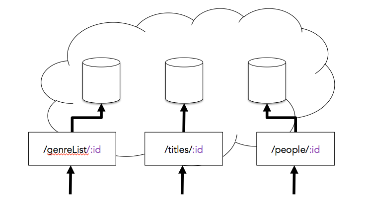
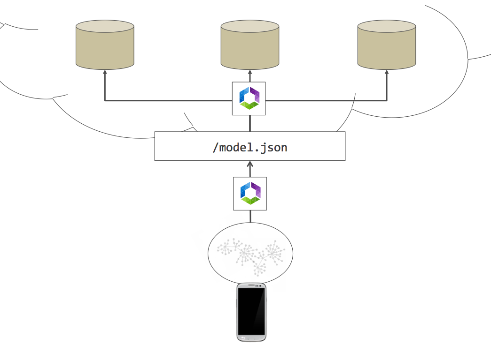
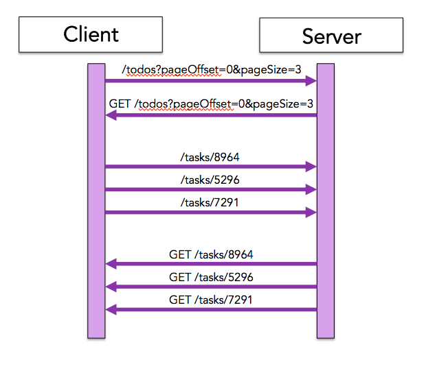
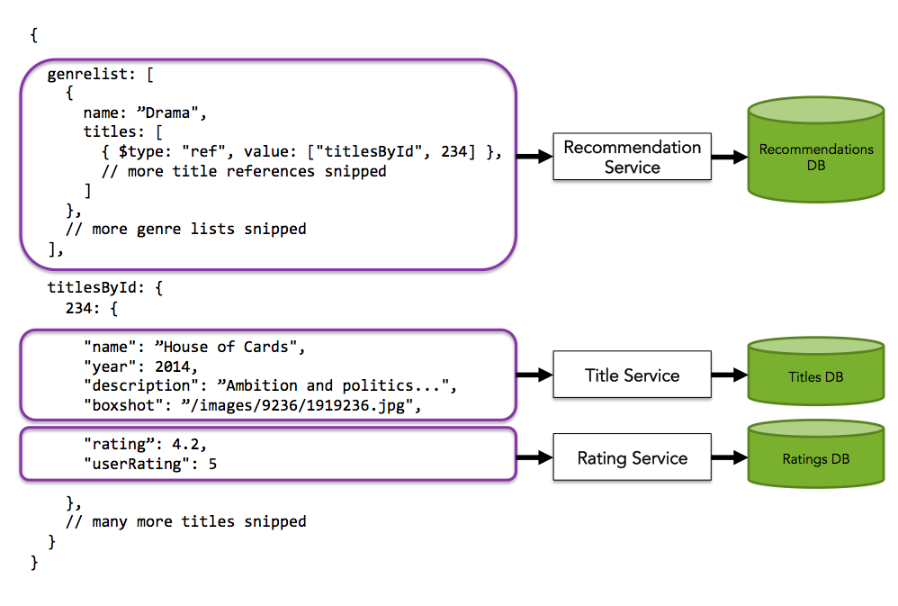

* Table of contents. This line is required to start the list.
{:toc}

# The Falcor Router

A Falcor Router is an implementation of the DataSource interface. Falcor Model objects use DataSources to retrieve JSON Graph data. However Models typically run on the client and Routers typically run on the Application server. As a result communication between a Model and the Router is typically remoted across the network using an HttpDataSource.

A Router works by matching requested paths against a "virtual" JSON Graph object. The JSON Graph object is referred to as "virtual", because the object rarely exists anywhere - in memory or on disk. Instead when paths are requested from the Router, the Router typically creates the necessary subsets of the JSON Graph on-demand by retrieving the necessary data from persistent data stores. Once the newly-created subset of the JSON Graph has been delivered to the caller, the Router frees the memory. This allows the Application Server running the Router to remain stateless, and keep the application's data in one or more persistent data stores.

In order to create the requested subset of the JSON Graph object, the Router matches the requested paths against a series of Routes. A Route is an object with a pattern that can match a set of paths, and is responsible for creating the subset of the JSON Graph object which contains the data requested by those paths. Typically Routes build a subset of the JSON Graph object on-demand by retrieving the data from persistent data stores or web services. The Route transforms the data retrieved from the data sources into the the schema of the JSON Graph, and delivers it to the Router. Once the Router receives the JSON Graph subset from the Route, it evaluates the paths against the JSON Graph subset using the (Path Evaluation) algorithm. If the router encounters References in the JSON Graph, it may optimize the requested paths, and recursively evaluate them against the Routes. The Router's final output is the subset of virtual JSON Graph that combines all the responses produced by the evaluated the requested paths against the Routes.

## Application Servers for REST services

Rather than serve static resources from disk, many RESTful Application servers use Routers to create resources on-demand by retrieving data from one or more persistent datastores.

For example here is a Router defined for Node's ExpressJS MVC framework which uses a route to match a request for a task resource by ID:

~~~js
var express = require('express');
var app = express();

app.get('/task/:id', function(req, res) {
    taskService.get(req.params.id, function(error, task) {
        if (error) {
            res.send(500);
        } else {
            res.send(200, JSON.parse(task));
        }
    });
});
~~~

Routers allow application servers to remain stateless. Instead of storing state on the application server, requests for information are matched against URL patterns and requests for data are routed to persistent data stores.

## RESTful App Servers vs. Falcor App Servers

Traditional Application servers expose information at multiple URLs. Falcor App servers expose all of the data the client needs as a single JSON URL.

Exposing all of the client's data as a single HTTP resource gives the client the ability to request all of the data that it requires for any applications scenario using a single HTTP request. This allows the client to get around any restrictions on the number of concurrent HTTP requests which can be sent. It also reduces the relative overhead introduced by HTTP calls by allowing many values to be retrieved in a single request.

Instead of downloading the entire JSON resource, clients pass paths to the values they want to retrieve from the JSON resource in the query string.

~~~
http://.../model.json?paths=[["todos",{from:0,to:2},"name"]]
~~~

The server responds with a subset of the JSON resource which contains the requested values. 

~~~js
{
    "jsonGraph": {
        "todos": {
            "0": {
                "name": "get milk from corner store."
            },
            "1": {
                "name": "go to the ATM."
            },
            "2": {
                "name": "pick up car from the shop."
            }
        }
    }
} 
~~~

Another key difference between traditional RESTful application servers and Falcor application servers is the way in which relationships are discovered. Traditional RESTful application servers specify hyperlinks to related resources. 

The following request attempts to retrieve three task objects:

~~~
http://.../todos?pageOffset=0&pageSize=3
~~~

The server returns three hyperlinks to task resources.

~~~js
[
    "/task/8964",
    "/task/5296",
    "/task/9721"
]
~~~

This means that in order for a traditional client to download both a resource and its related resources, at least two JSON requests must be made.

Instead of using hyperlinks to refer to other resources, Falcor applications represent relationships as references to other locations within the same JSON resource. For example, the following request attempts to retrieve the name of the first three tasks in the todos list:

~~~js
http://.../model.json?paths=[["todos",{from:0,to:2},"name"]]
~~~

The Falcor application server sends the following response:

~~~js
{
    "json": {
        "todos": {
            "0": { $type: "ref", value: ["todosById", 8964] },
            "1": { $type: "ref", value: ["todosById", 5296] },
            "2": { $type: "ref", value: ["todosById", 9721] }
        },
        "todosById": {
            "8964": {
                "name": "get milk from corner store."
            },
            "5296": {
                "name": "go to the ATM."
            },
            "9721": {
                "name": "pick up car from the shop."
            }
        }
    }
} 
~~~

This is possible because Falcor application servers expose all their data within a single JSON resource. The important difference between references and hyperlinks is that references can be followed on the server whereas hyperlinks must be followed on the client. That means that instead of making sequential round trips, related values can be downloaded within the same request.

## Contrasting a REST Router with a Falcor Router 

Falcor Routers serve the same purpose as Routers for RESTful endpoints: they allow app servers to remain stateless by retrieving requested data from persistent data stores on-demand. However a Falcor Router differs from the Router used by RESTful application servers in a few ways in order to accommodate the unique way in which Falcor app servers expose their data.

There are three primary differences between a traditional Application Router and a Falcor Router.

### 1. Falcor Routers match JSON paths, not URL Paths

Instead of matching patterns in URLs, the Falcor Router matches patterns in the paths requested in the query string of the single JSON resource.

~~~js
http://.../model.json?paths=[["todos","name"],["todos","length"]]
~~~

~~~js
var Router = require("falcor-router");
var router = new Router([
    {
        route: 'todos.name',
        get: function(pathSet) {
            return todosService.getName();
        }
    },
    {
        route: 'todos.length',
        get: function(pathSet) {
            return todosService.getLength();
        }
    }
]);
~~~

### 2. A Single Falcor Route Can Match Multiple Paths

Traditional App server Routers only need to match the URL path, because HTTP requests are designed to retrieve a single resource. In contrast a single HTTP request to a Falcor application server may contain multiple paths in the query string. As a result a single Falcor route can match multiple paths at once. Matching multiple paths in a single route can be more efficient in the event they can be retrieved with a single backend request.

The following request attempts to retrieve the name of the first three tasks in the todos list:

~~~js
http://.../model.json?paths=[["todos",{from:0,to:2},"name"]]
~~~

The following route will match all three paths and handle them at the same time:

~~~js
var Router = require("falcor-router");
var router = new Router([
    {
        route: 'todos[{integers:indices}].name',
        get: function(pathSet) {
            // pathSet = ["todos",[0,1,2],"name"]
            // pathSet.indices = [0,1,2]
            return todosService.
                getTasks(pathSet.indices).
                then(function(taskListItems) {
                    // taskListItems = [
                    //  { index: 0, value: { name: "get milk from corner store", done: false } },
                    //  { index: 1, value: { name: "go to the ATM", done: false } },
                    //  { index: 2, value: { name: "pick up car from the shop", done: false } }
                    // ]
                    return taskListItems.
                        map(function(taskListItem) {
                            // create a response for each individual path
                            return { path: ["todos", taskListItem.index, "name"], value: taskListItem.value.name };
                        });
                });
        }
    }
]);

router.get([
    ["todos", {from: 0, to: 2 }, "name"]
]).subscribe(function(jsonGraph) {
    console.log(JSON.stringify(jsonGraph, null, 4));
});
~~~

The route above retrieves the data for multiple paths using a single request to a webservice, and returns the results as a Promise of several path/value pairs.

~~~js
[
    { path: ["todos", 0, "name"], value: "get milk from corner store." },
    { path: ["todos", 1, "name"], value: "go to the ATM." },
    { path: ["todos", 2, "name"], value: "pick up car from the shop." }
]
~~~

The Router accepts all of these path/value pairs, adds them to a single JSON object, and then sends it back to the client as the response.

~~~js
{
    "jsonGraph": {
        "todos": {
            "0": {
                "name": "get milk from corner store."
            },
            "1": {
                "name": "go to the ATM."
            },
            "2": {
                "name": "pick up car from the shop."
            }
        }
    }
} 
~~~

### 3. Retrieving Related Resources on the Server

In addition to allowing multiple values to be retrieved in a single request, Falcor routers can also traverse entity relationships and retrieve related values within the same request.

REST APIs often expose different kinds of resources at different end points. These resources often contain hyperlinks to related resources. For example the following endpoint /todos returns a JSON array of hyperlinks to task resources:

~~~js
[
    "/task/8964",
    "/task/5296",
    "/task/9721"
]
~~~

RESTful clients traverse entity relationships by making follow-up requests for the resources at these hyperlinks. 

Unlike RESTful servers, Falcor Application servers expose all of an application's domain data as a single JSON Graph resource. Within a the JSON Graph resource, entity relationships are expressed as references to other entities in the same resource rather than hyperlinks to different resources. 

When Falcor clients request paths to values within the JSON Graph resource, Falcor Routers follow the Path Evaluation Algorithm and automatically traverse any references encountered along the path provided by the client.

For example the following path retrieves a reference to the first task object in a JSON Graph resource, much the same way as the RESTful /todos resource contains hyperlinks to task resources. 

~~~js
http://.../model.json?paths=[["todos",0]]
~~~

The server responds with the following JSONGraphEnvelope:

~~~js
{
    "jsonGraph": {
        "todos": {
            "0": { $type: "ref", value: ["todosById", 8964] }
        }
    }
} 
~~~

However if the path is altered to retrieve keys from the entity located at the reference, the Falcor Router traverses the reference on the server and retrieves the values from the entity located at the reference path. The result is a fragment of the JSON Graph object which contains all of the references encountered during path evaluation as well as the requested value.

~~~js
http://.../model.json?paths=[["todos",0,"name"]]
~~~

The server responds with the following JSONGraphEnvelope:

~~~js
{
    "jsonGraph": {
        "todos": {
            "0": { $type: "ref", value: ["todosById", 8964] }
        },
        "todosById": {
            "8964": {
                "name": "get milk from corner store."
            }
        }
    }
} 
~~~

## Creating a Router Class
 
A Router Class is created by invoking the Router.createClass method. This Class factory method accepts an Array of Route objects. Each Route object contains a path pattern, and an optional series of handlers for the various DataSource methods: get, set, and call.
 
~~~js
var Router = require("falcor-router");

// Create a Router base class
var BaseRouter = Router.createClass([
    {
        route: 'todos[{integers:indices}].name',
        // Route handlers are run with the Router instance as their this object
        get: function(pathSet) {
            if (this.userId == null) {
                throw new Error("not authorized");
            }  
            // Route implementation snipped
        },
        set: function(jsonGraph) {
            if (this.userId == null) {
                throw new Error("not authorized");
            }  
            // Route implementation snipped
        }        
    }
]);

// Creating a constructor for a class that derives from BaseRouter
var TODORouter = function(userId){
    // Invoking the base class constructor
    BaseRouter.call(this);
    this.userId = userId;
};

// Creating a derived class using JavaScript's classical inheritance pattern
TODORouter.prototype = Object.create(BaseRouter);
~~~

The next version of JavaScript (ES2015) has native support for classes. If you are using a version of node that supports classes, or you are using a transpiler, you can write this code instead of the code seen above:

~~~js
var Router = require("falcor-router");

// Create a Router base class
class TODORouter extends
    // create base class in-line
    Router.createClass([
        {
            route: 'todos[{integers:indices}].name',
            // Route handlers are run with the Router instance as their this object
            get: function(pathSet) {
                if (this.userId == null) {
                    throw new Error("not authorized");
                } 
                // Route implementation snipped
            },
            set: function(jsonGraph) {
                if (this.userId == null) {
                    throw new Error("not authorized");
                }
                // Route implementation snipped
            }      
        }
    ]) {
    
    constructor(userId) {
        super();
        this.userId = userId;
    }
}
~~~

### Why Create a Router Class Instead of a Router Instance?
 
When an Array of routes is passed to the createClass method, an internal Route Map is generated. The Route Map is a stateless data structure designed to improve the speed of pattern matching. Ideally the process of creating the Route Map should only be performed once when your Web server starts up. However Router instances often require access to connection information (ex. authorization information, included in the cookies of an HTTP Request). Creating a Router class generates the route map once, and allows the route map to be shared with every new instance of the Router class.

~~~js
// todo-router.js
var Router = require("falcor-router");
// Create a Router base class
class TODORouter extends
    // create base class in-line
    Router.createClass([
        {
            route: 'todos[{integers:indices}].name',
            get: function(pathSet) {
                // Route handlers are run with the Router instance as their this object.
                // Therefore the userId member must be set by the constructor.
                if (this.userId == null) {
                    throw new Error("not authorized");
                } 
                // Route implementation snipped
            }
        }
    ]) {
    
    constructor(userId) {
        super();
        this.userId = userId;
    }
}

module.exports = TODORouter;
~~~

These derived Router class instances can be instantiated at connection time, and passed connection information via their constructor. All route handler functions are applied to the concrete Router instance, which means that Routes can access connection state passed to the Router via the "this" pointer.
 
Typically a single Router class is created when the application server starts up, and then one instance is created per connection and then thrown away.

~~~js
// app.js
var express = require('express');
var cookieParser = require('cookie-parser')
var bodyParser = require('body-parser');
var falcorMiddleware = require('falcor-express');
var TODORouter = require('./todo-router');

var app = express();
app.use(bodyParser.urlencoded({ extended: false }))
app.use(cookieParser());

// Create a new Router instance for each new request
app.use('/model.json', falcorMiddleware.dataSourceRoute(function(req, res) {
    return new TODORouter(req.cookies.userId);
}));

var server = app.listen(80);
~~~

### Route Objects
 
Each Route object passed to the Router constructor contains a pattern that can be used to match Path Sets, as well as three optional handlers that correspond to each of the DataSource interface's methods.
 
When one of the DataSource methods is invoked on the Router object, the Router attempts to match the paths against the patterns in each route.  If a Route's pattern is matched, the corresponding route handler method is invoked.  The Route handler is expected to perform the corresponding action and generate the subset of the JSON Graph containing the requested path.
 
For an example, take the following Router which matches the set of paths that attempts to retrieve a user name or surname:

~~~js
var BaseRouter = Router.createClass([
    {
        route: 'user.["name", "surname"]',
        get: function(pathSet) {
            // pathSet is ["user", ["name"]] or ["user", ["surname"]] or ["user", ["name", "surname"]]
            if (this.userId == null) {
                throw new Error("not authorized");
            } 
            return userService.
                get(this.userId).
                then(function(user) {
                    // pathSet[1] is ["name"] or ["surname"] or ["name", "surname"]
                    return pathSet[1].map(function(key) {
                        return { path: ["user", key], value: user[key] };
                    });
                });
        }
    }
]);

// Creating a constructor for a class that derives from BaseRouter
var AppRouter = function(userId){
    // Invoking the base class constructor
    BaseRouter.call(this);
    this.userId = userId;
};

// Creating a derived class using JavaScript's classical inheritance pattern
AppRouter.prototype = Object.create(BaseRouter);    
~~~
 
Let's say the following request is made for the "name" and "surname" of the user:

~~~js 
routerInstance.get([["user",["name","surname"]]])
~~~
 
Once the Router determines that a route's pattern matches a subset of the requested Path Set, the Router will invoke the matching route's get handler with a PathSet containing the set of paths that matched the route pattern:
 
~~~js
matchingRoute.get.call(routerInstance, ["user",["name","surname"]])
~~~

Note that each Route handler is applied to the Router instance, meaning it can access Router properties using the "this" object.  Note as well that the matching path is passed to the handler using the Path Array syntax. 
 
Each route is responsible for creating a subset of the JSON Graph object that contains the requested values.
 
~~~js
{
    route: 'user.["name", "surname"]',
    get: function(pathSet) {
        // pathSet is ["user", ["name"]] or ["user", ["surname"]] or ["user", ["name", "surname"]]
        if (this.userId == null) {
            throw new Error("not authorized");
        } 
        return userService.
            get(this.userId).
            then(function(user) {
                // pathSet[1] is ["name"] or ["surname"] or ["name", "surname"]
                return pathSet[1].map(function(key) {
                    return { path: ["user", key], value: user[key] };
                });
            });
    }
}
~~~ 

The Router combines all of these subsets of the JSON Graph object returned by each individual route into a single JSON Graph object subset, and returns it to the caller.
 
#### Route Handler Response Formats
 
Each route handler is responsible for creating a subset of the JSON Graph that contains the values found at the requested paths. These values can be delivered in one of two formats:
 
* JSON Graph Envelope
* A Series of PathValues
 
A JSON Graph envelope is an object with a "jsonGraph" key that contains a subset of a JSON is responsible for creating the subset of the JSON Graph Envelope that contains the requested paths.
 
In the following example, a route returns JSON Graph envelope containing both the name and surname of a user:
 
~~~js
{
    route: 'user.["name", "surname"]',
    get: function(pathSet) {
        // pathSet is ["user", ["name"]] or ["user", ["surname"]] or ["user", ["name", "surname"]]
        if (this.userId == null) {
            throw new Error("not authorized");
        } 
        return userService.
            get(this.userId).
            then(function(userObject) {
                var jsonGraph = {};
                var user = jsonGraph["user"] = {};
                // pathSet[1] is ["name"] or ["surname"] or ["name", "surname"]
                pathSet[1].forEach(function(key) {
                    user[key] = userObject[key];
                });
                
                return { jsonGraph: jsonGraph };
            });
    }
}
~~~ 
 
A PathValue is an object with a path and value key. In lieu of a JSON Graph object containing all requested values, a Route can return a PathValue for each requested path:
 
~~~js
{
    route: 'user.["name", "surname"]',
    get: function(pathSet) {
        // pathSet is ["user", ["name"]] or ["user", ["surname"]] or ["user", ["name", "surname"]]
        if (this.userId == null) {
            throw new Error("not authorized");
        } 
        return userService.
            get(this.userId).
            then(function(user) {
                // pathSet[1] is ["name"] or ["surname"] or ["name", "surname"]
                return pathSet[1].map(function(key) {
                    return { path: ["user", key], value: user[key] };
                });
            });
    }
}
~~~ 

As in the previous example, this route returns the name and surname of a user. However this time it returns two PathValue objects, one containing the path and value of the name, and the other containing the path and value of the surname.
 
When a Router receives a series of PathValue's, it creates the JSON Graph envelope by writing each PathValue's value into an object at the PathValue's path.
 
~~~js
[
    { path: ["user","name"], value: "Anupa" },
    { path: ["user","surname"], value: "Husain" }
]
// is converted to...
{
    jsonGraph: {
        user: {
            name: "Anupa",
            surname: "Husain"
        }
    },
    paths: [
        ["user", ["name", "surname"]]
    ]
}
~~~ 

If your Route progressively builds up JSON Graph envelopes from a series of values, returning PathValues can be a more convenient alternative.
 
#### Route Handler Concurrency
 
In addition to returning either JSON Graph envelopes or path values synchronously, Router handlers can also return their data asynchronously by delivering their output data in either of the following containers:

* Promise
* Observable
 
In the following example a Route handler retrieves the name and surname of a user from a persistent DataStore, and returns the results in an ES6 Promise:
 
~~~js
{
    route: 'user.["name", "surname"]',
    get: function(pathSet) {
        // pathSet is ["user", ["name"]] or ["user", ["surname"]] or ["user", ["name", "surname"]]
        if (this.userId == null) {
            throw new Error("not authorized");
        } 
        return userService.
            get(this.userId).
            then(function(user) {
                // pathSet[1] is ["name"] or ["surname"] or ["name", "surname"]
                return pathSet[1].map(function(key) {
                    return { path: ["user", key], value: user[key] };
                });
            });
    }
}
~~~ 

For more information on Promises, see this [article](https://www.promisejs.org/)
 
Alternately a Router Handler can return the PathValue results progressively using an Observable:
 
~~~js
var Rx = require("rx");
var Observable = Rx.Observable;

// snip...
{
    route: 'user.["name", "surname"]',
    get: function(pathSet) {
        // pathSet is ["user", ["name"]] or ["user", ["surname"]] or ["user", ["name", "surname"]]
        if (this.userId == null) {
            throw new Error("not authorized");
        } 
        return Observable.
            fromPromise(userService.get(this.userId)).
            flatMap(function(user) {
                // pathSet[1] is ["name"] or ["surname"] or ["name", "surname"]
                return Observable.
                    fromArray(pathSet[1]).
                    map(function(key) {
                        return { path: ["user", key], value: user[key] };
                    });
            });
    }
}
~~~

An Observable is similar to a Promise, with the principal difference being that an Observable can send multiple values over time. The main advantage of using a Observable over a Promise is the ability to progressively return PathValues to the Router as soon as they are returned from the underlying DataSource.  In contrast, when delivering values in a Promise, all values must be collected together in a JSON Graph envelope or an Array of PathValues and returned to the Router at the same time.
 
Using an Observable can improve throughput, because Routers may make additional requests to backend services in the event references are discovered in a Route Handler's JSON Graph output.

When a Router discovers a reference before a path has been fully evaluated, it optimizes the Path and matches the newly optimized path against the Routes. When a path is optimized it is matched against the Router's Routes again. This may in turn trigger subsequent backend requests, which means that getting the references within a Route response back to the Router earlier can sometimes improve throughput.
 
For an overview on Observable, see this [video](https://www.youtube.com/watch?v=XRYN2xt11Ek).
 
#### Route Pattern Matching
 
Route patterns support a superset of the PathSet syntax, which means they can match any PathSet. In addition to allowing matching explicit Ranges and KeySets in indexers, Route patterns may contain any of the following three special tokens:

~~~
{integers}
{ranges}
{keys}
~~~

##### The {integers} Pattern

The {integers} pattern will match any integers in a KeySet, including those specified in a Range. All matched keys are normalized into an Array of integers.

For example...

~~~
titlesById[235,223,555,111...113].name
~~~

...matched against...

~~~
titlesById[{integers}].name
~~~

...will produce the following Path Set to be passed to the route handler:

~~~
["titlesById", [234,223,555,111,112,113],"name"]
~~~

This pattern is most often when matching entities by an integer ID. For example, the following route builds a map of all tasks by ID.

~~~js
var jsong = require('falcor-json-graph');
var Router = require('falcor-router');

var router = new Router([{
    route: 'tasksById[{integers:ids}]["name","done"]',
    get: function(pathSet) {
        // pathSet.ids is [234,122]
        return todoService.
            get(pathSet.ids).
            then(function(taskMap) {
                // taskMap is
                // {
                //     "234": { name: "Go to ATM", done: false },
                //     "122": null
                // }
                var jsonGraph = {},
                    tasksById = jsonGraph.tasksById = {},
                    task;
                
                pathSet.ids.forEach(function(id) {
                    var taskRecord = taskMap[id];
                    // if a Task does not exist, we explicitly insert an empty value
                    // at the task object, rather than its "name" or "done" field.
                    if (taskRecord == null) {
                        tasksById[id] = jsong.atom(taskMap[id]);
                    }
                    else {
                        task = tasksById[id] = {};
                        pathSet[2].forEach(function(key) {
                            task[key] = jsong.atom(taskRecord[key]);
                        });
                    }
                });
                
                return { jsonGraph: jsonGraph };
            });
    }
}]);

router.get([
    ["tasksById", [234, 122], "name"]
]).subscribe(function(jsongGraphEnvelope) {
    console.log(JSON.stringify(jsongGraphEnvelope, null, 4));
});
~~~
 
##### The {ranges} Pattern

The {ranges} pattern will match any integers in a KeySet whether specified in a Range, a string, or simply as a number. All matched keys are normalized into an Array of ranges.

For example...

~~~
genreList[0,1,5..7,9,"name"]
~~~

...matched against...

~~~
genreList[{ranges}].name
~~~

...will produce the following Path Set to be passed to the route handler:

~~~
["genreList", [{from:0,to:1}, {from:5,to:7}, {from:9,to:9}], "name"]
~~~

The {ranges} pattern is most often when matching indices in a list. It is ideal when the underlying service API supports paging. For example the following route retrieves the names of Netflix genre lists:

~~~js
var jsong = require('falcor-json-graph');
var Router = require('falcor-router');

var router = new Router([{
    route: 'genrelist[{ranges:indexRanges}].name',
    get: function(pathSet) {
        // pathSet.indexRanges is [{from:0,to:1}, {from:5,to:7}, {from:9,to:9}] 
        return genreListService.
            getGenreListsByRanges(pathSet.indexRanges).
            then(function(listItems) {
                // listItems is...
                // [ 
                //    { index: 0, value: { name: "Horror", titles: [ ... ] },
                //    { index: 1, value: { name: "Drama", titles: [ ... ] },
                //    { index: 5, value: { name: "New Releases", titles: [ ... ] },
                //    { index: 6, value: { name: "Action", titles: [ ... ] },
                //    { index: 7, value: { name: "Romantic Comedies", titles: [ ... ] },
                //    { index: 9, value: null }
                // ]
                return listItems.map(function(listItem) {
                    // if no object exists at a list item, insert an undefined value explicitly at the
                    // list item.
                    if (listItem.value == null) {
                        return { path: ["genrelist", listItem.index], value: jsong.atom(listItem.value) };
                    }
                    else {
                        return { path: ["genrelist", listItem.index, "name"], value: listItem.value.name };
                    }
                });
            });
    }
}]);

router.get([
    ["genreList", [0,1,5,6,7,9], "name"]
]).subscribe(function(jsongGraphEnvelope) {
    console.log(JSON.stringify(jsongGraphEnvelope, null, 4));
});
~~~
 
##### The {keys} Pattern

The {keys} pattern will match any valid key (string, number, boolean), or KeySet (an array of ranges or keys) and normalize the matching set of keys into an Array of keys.

For example...

~~~
genreList[0, 2..4, "length"]
~~~

...matched against...

~~~
genreList[{keys}]
~~~

...will produce the following Path Set to be passed to the route handler:

~~~
["genreList", [0, 2, 3, 4, "length"]]
~~~

This pattern is most often when matching entities by a GUID. For example, the following route builds a map of all titles by GUID.

~~~js
var jsong = require('falcor-json-graph');
var Router = require('falcor-router');

var router = new Router([{
    route: 'tasksById[{keys:ids}][{keys:props}]',
    get: function(pathSet) {
        // pathSet.ids is ["a32e8912f34","51f2928f34"]
        // pathSet.keys is ["name"]
        return todoService.
            get(pathSet.ids).
            then(function(taskMap) {
                // taskMap is
                // {
                //     "a32e8912f34": { name: "Go to ATM", done: false },
                //     "51f2928f34": null
                // }
                var jsonGraph = {},
                    tasksById = jsonGraph.tasksById = {},
                    task;
                
                pathSet.ids.forEach(function(id) {
                    var taskRecord = taskMap[id];
                    // if a Task does not exist, we explicitly insert an empty value
                    // at the task object, rather than its "name" or "done" field.
                    if (taskRecord == null) {
                        tasksById[id] = jsong.atom(taskMap[id]);
                    }
                    else {
                        task = tasksById[id] = {};
                        pathSet.keys.forEach(function(key) {
                            task[key] = jsong.atom(taskRecord[key]);
                        });
                    }
                });
                
                return { jsonGraph: jsonGraph };
            });
    }
}]);

router.get([
    ["tasksById", ["a32e8912f34", "51f2928f34"], "name"]
]).subscribe(function(jsongGraphEnvelope) {
    console.log(JSON.stringify(jsongGraphEnvelope, null, 4));
});
~~~

The {keys} can also be used to expose any key on a server object to the client. 

Each pattern will produce an array of results, even when matched against a single value.

## How a Router Works

The router implements the Data source interface, which allows a caller to work with serial graph data indirectly using three methods: get, set, and call. Routers are unusual in that rather than work against a pre-existing JSON Graph object stored somewhere, Routers generate JSON Graph data on-demand by retrieving the requested data from one or more data sources. As a Router's JSON Graph object is sometimes referred to as a "virtual" JSON Graph.

In this section we will examine how the router executes each of the DataSource methods. However rather than explain how each DataSource operation works in the abstract, we will define an sample Router and then explain how the DataSource operations are executed against it.

### Building a Sample Router for the Netflix Application

Netflix is a online streaming video service with millions of subscribers.  When a member logs on to the Netflix service, they are presented with a list of genres, each of which contains a list of titles which they can stream.

Our goal is to define a JSON graph resource on the Application server that exposes all of the data that the Netflix client needs. The serial graph schema should be designed in such a way that the Netflix application can retrieve all of the data it needs for any given application scenario in a single network request. In order to avoid creating and storing the entire JSON Graph object on the application server, we will define a Router. 

We would like to create a JSON Graph object on the server that looks like this:

~~~js
{
  genrelist: [
    {
      name: ”Drama",
      titles: [
        { $type: "ref", value: ["titlesById", 234] },
        // more title references snipped
      ]
    },
    // more genre lists snipped
  ],
  titlesById: {
    234: {
      "name": ”House of Cards",
      "year": 2014,
      "description": ”Ambition and politics...",
      "boxshot": ”/images/9236/1919236.jpg",
      "rating”: 4.2,
      "userRating": 5
    },
    // many more titles snipped
  }
}

~~~

We will create a Router that retrieves the data for this JSON Graph from three different data sources:

#### 1. The Recommendation Service

This service can be used to retrieve a personalized list of genres for each user. Each genre list contains a personalized list of titles included based on information gathered about the user's past preferences. The data in this service is stored in a separate database, and the personalized recommendations for all users are recomputed twice a day.

#### 2. The Title Service

This service can be used to retrieve information about titles in the catalog. This information is not personalized, changes relatively infrequently, and is therefore stored in a different database.

#### 3. The Rating Service

This service can be used to retrieve predicted ratings for every user and title combination. In addition, if users choose to override the predicted rating, this service is used to store their preferred rating. The rating information may be updated frequently based on user input, and is therefore stored in a separate database.

Each of these services will inform a different portion of the virtual JSON object:

Once we have built this virtual JSON Graph object, the client will be able to make requests like this:

~~~js
var model = new falcor.Model({ source: new falcor.HttpDataSource("/model.json") });

//  grab the name of the first four genre lists, as well as the 
// name and boxshot of the first five titles within each genre list
model.
    get("genrelists[0..3].name", "genrelists[0..3].titles[0..4]['name','boxshot']").
    then(function(jsonResponse) {
        console.log(JSON.stringify(jsonResponse, null, 4);
    });
~~~

#### Choosing the Routes

It would be challenging if we had to build a route for every possible path that the client might request from the virtual JSONGraph object.  Luckily this is not necessary. Why not?

**It is only legal to retrieve value types from a JSON Graph object.**

As a result, it is only necessary to build routes which match paths at which primitive value types can be found. Recall that these are the JSON value types:

* null
* string
* number
* true
* false

JSONGraph also adds three additional value types to JSON:

* ref
* atom
* error

Given that these are the only valid types which can be retrieved from a JSON Graph object, we only need to build the following routes to match the example JSONGraph object above.

~~~
"genrelist.length"
"genrelist[0].titles.length"
"genrelist[0].titles[0]"
"titlesById[234].name"
"titlesById[234].year"
"titlesById[234].description"
"titlesById[234].boxshot"
"titlesById[234].rating"
"titlesById[234].userRating"
~~~

Of course there may be any number of genrelists or any number of titles within a genrelist. Furthermore, the titlesById map may contain any number of titles. In order to match any genrelist index, any index within each genrelist's titles array, or any id in the titlesById map, we will use the {integers} pattern.

~~~
"genrelist.length"
"genrelist[{integers}].titles.length"
"genrelist[{integers}].titles[{integers}]"
"titlesById[{integers}].name"
"titlesById[{integers}].year"
"titlesById[{integers}].description"
"titlesById[{integers}].boxshot"
"titlesById[{integers}].rating"
"titlesById[{integers}].userRating"
~~~

 
#### The Service Layer

This Netflix-lite service layer exposes three different microservaces:

1. The Recommendations Database
##### The Genre List Service
 
The genre list service returns a list of genres, and their titles:
 
"http://api-global.netflix.com/apps/static/sample/genreLists"
 
(example output)
 
Note that the genre list service can contain duplicates, because the same title can appear in multiple genre lists. Later on when we expose titles to the client in a JSON Graph, we will use references to ensure that no title object appears more than once.

Let's add a service to our service layer called "genreList":

(Example of a genre list method in our service later class)
 
##### The Title Service
 
The title service allows titles to be requested by ID.
 
"http://api-global.netflix.com/apps/static/sample/titles?ids=5,6,7"
 
(example output)
 
Notice that each title has a unique identifier. Later on we will use this unique identifier to organize each title by its unique identifier in the JSON Graph.
 
Let's add a service to our service layer called "getTitlesById":

(Example of a getTitlesById method in our service later class)

##### The Search Service
 
The search service allows titles to be searched by a string:

"http://api-global.netflix.com/apps/static/sample/search?term=house"
 
Let's add the search service to our service layer called "search":

(Example of a search method in our service later class)

#### Designing the Domain Graph

When designing our JSON Graph schema, the goal is to enable the Netflix application to retrieve all of the data that it needs for any given application scenario in a single network request. In order to minimize the number of requests required by the Netflix application, we organize the data inside of the cereal graph in the same way in which the Netflix application navigates the data.

When the Netflix application starts up, it displays titles in a gallery. The minimum amount of data required to display the initial gallery screen would be the URL of the first 4 boxshots in the first 3 genre lists, as well as the name of the first three genre lists.
 
(Image)
 
Ideally the Netflix application would be able to retrieve this information using the following Path Sets:
 
"genreList[0..3].name"
"genreList[0..3].titles[0..4].boxshot"
 
In order for these paths to retrieved the necessary information, we would need the Router's JSON object to have the following structure:

(example Neflix JSON)
 
Note that this tree can contain duplicates, because multiple genre list could contain the same title. Multiple copies of the same object in a serial graph can create inconsistency in the Netflix client's cache if changes to one copy of an object are not migrated to all of the other copies. To eliminate all duplicates, we convert this cereal schema into a JSON Graph schema.

We can convert the serial object above to a JSON Graph in two easy steps:
 
1.     First we introduce a map that organizes all titles by their ID:
 
(example of what I said above)
 
2.     Then we replace every other title instance with a reference to its only location within the titles map.

(Example of what I said above)
 
The JSON Graph structure above will allow titles to be navigated by position in a two-dimensional grid. However the client also needs to be able to retrieve titles using a search term. 
 
(Image)
 
Rather than forcing the client to download all of the titles and genre lists in order to run a search locally, we will add a map of all possible searches to root of the JSON Graph object.

(example)
 
How can we add a map of every possible search to the JSON object?  This might seem impractical, because there are an infinite number of searches that a member might make. However recall that the Router only needs to create the subset of the JSON Graph that is requested by the client. That means that the entire set of searches that a member might make will never need to exist in memory at once. Instead a Router only needs to create the set of search results for the searches that the member actually makes. 

Here is a sample of the JSON Graph object we want to create with our router. 

(Example with a little sample data in all of the pads)

In the next section we will learn how to use routes to map the data in our back and services into the schema of our JSON Graph object on-demand.

#### Mapping from backend services to the JSON graph schema using Routes

In order to create a virtual JSON Graph with a Router, you must create a routes that match each path requested by the client, and dynamically create the subset of the JSON Graph by retrieving the requested data from backend services.

Let's take a look a look at a sample of the virtual JSON Graph object we are trying to create with our Router:

(Basically the same as the previous example)

A client might issue any of the following paths:

(Examples of past that can be requested, even some examples requesting objects and Arrays which are invalid)

How are we supposed to create routes that match this seemingly infinite variation of paths?

Here is the good news: it's easier than you might think.

Note that it is not possible to retrieve Arrays or Objects from a JSON Graph. The caller can only request value types from a DataSource.The JSON Graph value types include: 

String
Number
Boolean
Null
Atom
Error
Reference

Given that it is only legal for the client to retrieve value types from the JSON Graph, we can eliminate the following paths from our list of sample set of paths:

(The same list of past before, but this time with all of the past and evaluate two objects and a race crossed out )

While this dramatically reduces the number of paths we need to match with routes, note that the presence of references in the JSON Graph object means that there are many paths which might evaluate to the same value. For example, the following three paths all evaluate to the same value:

It would seem that the ability to follow references creates a nearly endless number of possible paths to the same value type within a serial graph object. How can we possibly create routes that match all of them?

More good news: we don't need to match every possible path to a value that goes through reference.

Note that references are value types. If create routes that match paths prefixes, the Router will accept partial matches, and run the Route Handler. If the Route handler matches a path prefix and returns a JSON Graph subset containing a reference, the Router will optimize the requested path using the path in the reference, and then recursively match the optimized path against the set of routes again. For more information on Path optimization, see (Path Optimization).

You don't need to fully understand how path optimization works right now. All you need to know is that the only paths you have to match are those that when evaluated return a value type. 

##### Matching the titlesById Paths

We need to create a route that matches the name, rating, boxshot, and description for a title in the titlesByIdMap. Using the {integers} keys and a keyset we can match any of these path patterns with a single route:

"titlesById[{integers}]["name", "description"]

(Code example ripped from the Falcor-router-demo, but calling the titles service layer)

Note that the result is a promise which contains an array of PathValues. Each PathValue is mixed into the final cereal graph message.

Let's say the following path was requested:

"titlesById[45].name"

In truth, this is much easier than it might seem because it is only possible to retrieve value types from a JSON Graph. At the JSON Graph value types include the cereal value types (string, boolean, number, null)

## Creating a Router for your Application

Creating a Router for your Application typically involves three steps:

1. Design a JSON Graph schema that is ideal for the needs of your application

2. Create a series of Routes to map between the schema of the data returned by your service layer to the schema of your application's JSON Graph

3. Add session caching and request collapsing where applicable to improve efficiency

In the next three sections of the document, we will go through these steps to build a Falcor endpoint for Netflix. Netflix is an application that merchandises streaming titles contains a list of titles which can be streamed online.

### 1. Designing a JSON Graph schema for your application

### 2. 
## Creating the Mock

Take the following JSON Graph object, which models a list of TODOs:

(Example of a list of todos)

Note that each task has a list of prerequisites. Each task also appears only once in the object under a map of all tasks by their ID. 

## Creating a Router for the Mock

In order to model the JSON Graph object using a router, we must build routes which match incoming path requests and return the requested data. The good news is that it is only legal to retrieve value types from a JSON Graph. That means that instead of matching every possible path that might be requested, we only have to match paths to the value types in our mock JSON Graph object.

(List of all the paths to the value types)

First we create a router, including a route which matches each of the paths above:

(Example of a router which matches constant paths and returns the constant data)

Now we can request the name of the first TODO in the tasks list.

(Example code of requesting the first to do in the list)

Note that we get a response that includes the subset of the JSON Graph that we asked for. However instead of being retrieved from memory, all of the data was retrieved from the route handler.

This demonstrates that a Router is capable of creating data on-demand. However this Router is not very useful.  This router matches static paths, which means it can never serve anything other than the data for paths we've defined explicitly. In the next step we will modify our Router to use route patterns, allowing it to retrieve any number of TODOs. We will also modify the Router to retrieve the data dynamically from a service.

## Retrieving Information from a service

The Router we built in the previous step was only capable of serving a static JSON object. There was no way to add items to the TODO list or mark tasks as complete. Most importantly it only returns data that we explicitly created. 

In this section we'll modify our Router to retrieve real data from a live service. 

Let's say we have a RESTful TODO service which retrieves a list of task IDs.

(Example of retrieving a rest URL from commandline and printing the results)

/todos

(An array of TODO IDs)

We can also look up an individual TODO and the IDs of its prerequisites.

/todo/4683

(An example of an individual to do)

To our allow Router to match any index in the TODO list, we modify our TODO list route to include the {ranges} pattern instead of a static index.

(example of what I said above)

The ranges pattern is typically used when the underlying data source supports a Paging API. Our TODOs service accepts query string parameters, which means the ranges pattern produces an output pathset which is ideal for passing directly to our todos service:

because it produces an output that is convenient to send to a page API. Our to do list service accepts page parameters.

The {ranges} pattern matches one or more integers or ranges and produces a pathset which contains an array of ranges. 

For example if the following request is made to the Router...

(Example of requesting a range of two dues from the router (0 to 10))

...it matches the route pattern... 

(The route pattern we defined above using the ranges pattern)

...which passes the following output to the route handler:

["todos", [{from:0, to:3}] ]

set is passed to the appropriate route handler, which retrieve the requested ranges from the list.

Typically the ranges pattern is used when the underlying service which retrieves list items accepts pages

Clients can only request value types from a JSON Graph. That means that in order to build a router for a JSON Graph object, you must only create a route for any path in graph at which a value type may appear.

Instead of creating a JSON object upfront and storing it in memory or on disk, you can use a Falcor Router to lazily-create JSON data requested by the client on-demand.

(Example of creating identical document with router)

A Router implements the DataSource interface. Models use DataSources to retrieve data from a JSON Graph object. That means you can connect a model directly to a router.

(Example of connecting a model to a router)

Instead of creating a JSON object all at once upfront, you can use a router to create subsets of the object on-demand.

(Diagram showing how the writer worked with multiple data stores)

Typically application servers use a router to create the illusion that the entire JSON Graph object is 

Creating a Router

A Router is made up of an Array of Route objects. Each Route object contains a path pattern matcher, and a three optional callbacks corresponding to the three operations supported by a data source: get, set, and call. Each path pattern must match the path to a value type, because it is only possible to retrieve value types from a JSON Graph. The JSON Graph value types that can be returned from a Route include:

string
boolean
number
null
atom
reference
error

Each of these value types is highlighted in green in the example JSON Graph object below:

(An example JSON Graph that contains all of the value types listed above)

In order for a router to simulate the JSON Graph object above, a route would need to be defined which matched every path along which a value type may be found:

(A list of routes that match each and everyone of the path patterns above)

As we can see from the example above, a Router allows us to requested fragments of a JSON Graph on-demand. This is a nice alternative to creating the document up-front

Now that we have this list of paths, we can create routes for each path pattern:

(A list of patterns that match each individual path defined above)

Reference handling

There may be many different paths to the same value in a graph. Rather than creating routes for every possible path to a value, you specify the routes to the references in your JSON Graph. When a router encounters a reference while evaluating a path on the output of a route handler, it optimizes the path and recursively matches the optimized path against the routes again. This process continues until the path is fully evaluated or a value type other than a reference is encountered. This path evaluation process is functionally equivalent to the path evaluation process that takes place against an in memory JSON Graph object.

In the following example JSON Graph, we can access the country object using two different paths: 

(Example of what I just said above)

Get operations

When the client requests paths from the JSON Graph object, the paths are are matched against the pattern matcher in each route object. The subset of the path set which matches the route's pattern is then passed to the route's "get" pathset handler:

(Example of a subset of a path being passed to the get handler function)

The router's "get" pathset handler can either return a path value for each matched path, or a JSON Graph envelope which contains a value for each matched path.

(Example of a get handler returning two path values (titles by ID, 34, name, title, 34, rating)

(Example of a get handler returning two values (titles by ID, 34, name, title, 34, rating) in a JSON Graph envelope)

If a route handler does not return a value for a path that it matched, the value of that path is assumed to be undefined. However a Route handler should be as specific as possible about which key in a path is undefined value. In the example below, an attempt to retrieve the name of a Netflix title by identifier fails, because the title does not exist in the database. As a result, an explicit undefined value is created and positioned at the path to the title object, rather than the path to the name of the title object. This conveys that the title does not exist rather than the name of the title. 

(Example of the thing I just said above)

This additional context is valuable to UIs, which can use this information to decide whether or not to create a view for a title object or not.

(Example of a get operation for a title's name revealing a JSON message with no value at titlesById, 347)

e of returning an undefined value at using Model.undefined()

The get handler must create a value for every path in the path set. If a path value is undefined, 

When the get method is invoked on the router, each requested pathset is matched against the pattern in the route object. If the pattern matches, the subset of the path set 

(Example of creating a router that matches

uter is ideal for backends that tend to require sequential calls to serve requests. For example, if your Applications data is distributed across multiple data stores, or must be accessed through underwriting of different services, using a router can produce client/server interaction patterns similar to hand-written code.

A router is made up of a series of routes
