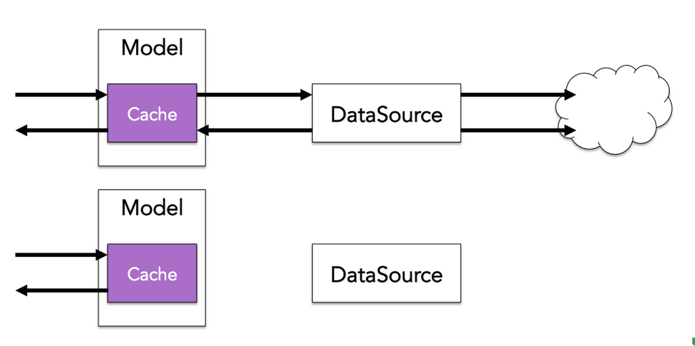
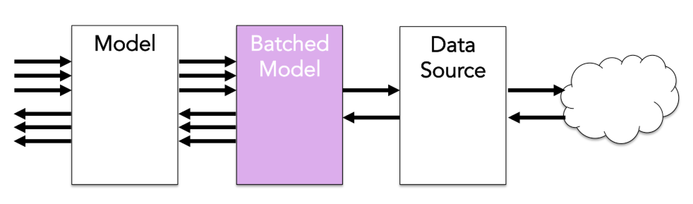

# How Does Falcor Work?

The Falcor Model transparently handles all network communication with the server. In order to ensure efficient client/server interactions, the Falcor Model applies a variety of different optimizations:

## Caching

Falcor maintains a fast in–memory cache that contains all of the values previously retrieved from the application server's JSON object. If a request is made for information that is already available in the cache, the data will be retrieved from the cache and sent to the consumer's callback as soon as possible.

To prevent the cache growing larger than the available memory on the device, developers can configure a maximum size for the cache. When the cache grows beyond the maximum size, the least-recently-used values are purged. This makes it possible to run the same application on an inexpensive mobile device or a powerful desktop machine.

## Batching

Falcor's ability to select as much or as little data from the network in a single request gives it the flexibility to batch multiple small requests for data into a single large request. The Falcor model can be configured to collect up multiple requests, and schedule them to be sent to the data source at once.

In this example, we make a request for three individual values from the Model, and only a single coarse-grained request is sent to the data source.

~~~js
var log = console.log.bind(console);
var httpDataSource = new falcor.HttpDataSource("/model.json");
var model = new falcor.Model({ source: httpDataSource });
var batchModel = model.batch();

batchModel.getValue("todos[0].name").then(log);
batchModel.getValue("todos[1].name").then(log);
batchModel.getValue("todos[2].name").then(log);

// The previous three model requests only send a single request
// to the httpDataSource: "todos[0..2].name" 
~~~

The ability to batch requests can significantly improve performance when using a network protocol with a high connection cost (ex. HTTP).

## Request Deduping

In addition to batching outgoing requests, the Falcor Model dedupes requests. If a request is made for a value for which there is already an outstanding request, no additional request is made. This allows individual application views to retrieve their own data without having to coordinate with other views, just as if they were retrieving data from a fast in-memory JSON store.
