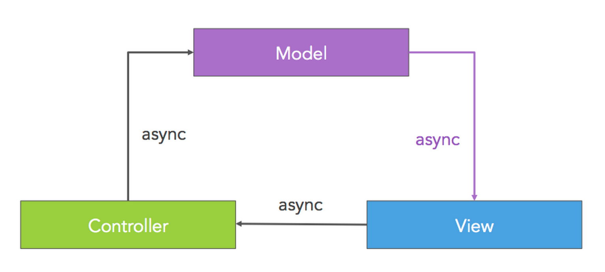

# What is Falcor?

Falcor is the innovative data platform that powers the Netflix UIs. Falcor allows you to model all your backend data as a single Virtual JSON object on your Node server. On the client you work with your remote JSON object using familiar JavaScript operations like get, set, and call. If you know your data, you know your API. 

Falcor is middleware. It is not a replacement for your application server, database, or MVC framework. Instead Falcor can be used to optimize communication between the layers of a new or existing application. 

## One Model Everywhere

Falcor allows you to model all of your backend data as a single JSON resource on the application server.

Clients request subsets of this JSON resource on demand, just like they would from an in-memory JSON object. To retrieve values from the JSON resource on the server the client passes the server JavaScript paths to each desired value within the JSON object. The server responds with a subset of the JSON object that contains only those values.

~~~
/model.json?paths=["user.name", "user.surname", "user.address"]

GET /model.json?paths=["user.name", "user.surname", "user.address"]
{
  user: {
    name: "Frank",
    surname: "Underwood",
    address: "1600 Pennsylvania Avenue, Washington, DC"
  }
}
~~~

Exposing all data as a single URL allows clients to request all of the data they need in a single network request. This can reduce latency by avoiding sequential server round trips.

In order to ensure that your application server remains stateless, Falcor provides a specialized Router which routes requests for values within the JSON object to different backend services.

Instead of matching URLs, the Falcor Router matches one or more JavaScript paths.

~~~
var router = new Router([
  {
    // matches user.name or user.surname or user.address
    route: "user['name','surname','address']",
    get(pathSet) {
      // pathSet could be ["user", ["name"]], ["user", ["name", "surname"]], ["user", ["surname", "address"]] and so on...
      userService.
        getUser(getUserID()).
        then(function(user) {
          return pathSet[1].
            map(function(userKey) {
              // return response for each individual requested path
              return {
                path: ["user", userKey],
                value: user[userKey]
              };
            });
         });
    }
  }
});
~~~

The Falcor Router allows you to expose a single JSON model to the client, while giving you the flexibility to store your data anywhere. 

## The Data is the API

You do not need to learn a complicated service layer to work with your data when you are using Falcor. If you know your data, you know your API. Falcor allows you to work with remote data the same way you work with local data, using JavaScript paths and operations. The primary difference is that Falcor’s client API is asynchronous.

Here’s an example retrieving the surname of a user directly from an in-memory JSON object using a simple JavaScript path.

~~~js
var model = {
  user: {
    name: "Frank",
    surname: "Underwood",
    address: "1600 Pennsylvania Avenue, Washington, DC"
  }
};

// prints “Underwood”
console.log(model.user.surname);
~~~

Applications that use Falcor do not work directly with JSON data. Instead they work with their JSON data indirectly using a Falcor Model. The Falcor Model allows you to use familiar idioms like JavaScript paths and JavaScript operations to work with your data. The primary difference between working with JSON data directly and using a Falcor Model, is that a Falcor Model has an asynchronous API.

Let’s rewrite the code above using a Falcor Model instead of working with the JSON directly:

~~~js
var model = new falcor.Model({
  cache: {
    user: {
      name: "Frank",
      surname: "Underwood",
      address: "1600 Pennsylvania Avenue, Washington, DC"
    }
  }
});

// prints “Underwood” eventually
model.
  getValue(“user.surname”).
  then(function(surname) {
    console.log(surname);
  });
~~~

Note that we use the same JavaScript path to retrieve our data as when we worked with the JSON data directly. The only difference is that the result is pushed to a callback when it becomes available.

The advantage of working with your data using Falcor’s asynchronous API is that you can move your data anywhere on the network without changing the client code that consumes the data. Using the Falcor Model, we only need to change a few lines of code to alter the previous example to work with remote data.

~~~js
var model = new falcor.Model({
  source: new falcor.HttpDataSource(“/model.json”)
});

// prints “Underwood” eventually
model.
  getValue(“user.surname”).
  then(function(surname) {
    console.log(surname);
  });
~~~

Now instead of working with in-memory JSON data, Falcor remotes requests for data to the application server’s Virtual JSON object. The Router retrieve the data from the data store with the information, and sends back only the requested fields.

Using an asynchronous API allows you to use the same programming model regardless of whether your data is local or remote. With Falcor it is common practice to begin development immediately by mocking the server’s JSON object. Once the server’s JSON resource has been written, the Falcor Model is connected to the server JSON using an HttpDataSource. No other client code needs to change. This approach can shrink project timelines by decoupling client and server developers.

## Bind to the Cloud

In most MVC systems, controllers are responsible for retrieving data from the server. One pattern for building applications with Falcor is to have your views retrieve data directly from the Falcor Model, just as they would from an in-memory JSON object. This pattern is sometimes referred to as **Async MVC**, because the communication between the view and the model is asynchronous.

In addition to decoupling controllers and views Async MVC can improve the efficiency of your application’s network requests. When the view drives the data fetching, only the data absolutely required to render a view is retrieved from the server.

In addition to **Async MVC** there are a variety of different patterns for integrating Falcor into your application. We are looking to the community for help building adapters for the various frameworks in use today.
